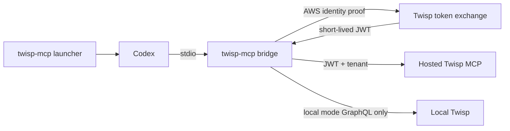

# twisp-mcp

A local stdio bridge to Twisp's authenticated cloud MCP, with an optional direct
GraphQL connection for local development. It can launch Codex with the bridge
configured for that session and obtain renewable Twisp tokens from AWS credentials.

| Mode | `graphql_execute` | Search, documentation, and other tools |
| --- | --- | --- |
| `local` (default) | Direct to `TWISP_ENDPOINT` | Cloud MCP |
| `cloud` | Cloud MCP | Cloud MCP |



## Build and install

Requires **Go 1.25.5 or newer**. To use the launcher, install the
[Codex CLI](https://learn.chatgpt.com/docs/extend/mcp?surface=cli) on `PATH`.

```bash
git clone git@github.com:parsnips/twisp-mcp.git
cd twisp-mcp
make install
```

This builds `./twisp-mcp` and installs it in `~/bin/twisp-mcp`. For an existing
checkout, pull `main` and run `make install` again. If your shell exports a
`GOWORK` pointing to another repository, run `GOWORK=off make install`.

## Launch Codex against the cloud

You need an existing Twisp tenant/account, a deployed MCP endpoint, and an AWS
identity registered as a client in that tenant. The AWS profile and the Twisp
account are separate: choosing an AWS profile does not select a Twisp tenant.
A profile named `dev-ro` is read-only only if its Twisp client policies enforce
that access. This bridge does not grant additional permissions.

### With Twisp's `aws/env` wrapper

Run from your Twisp core checkout:

```bash
./aws/env us-east-1 dev-ro \
  ~/bin/twisp-mcp --mode cloud --account '<tenant>' codex
```

The bridge infers `dev` from `ZONE` and `us-east-1` from `AWS_REGION`, both set by
that wrapper. It uses the AWS session supplied by `aws-vault`. To avoid repeating
the account, set `TWISP_MCP_ACCOUNT_ID` before launching.

### With a standard AWS profile

Configure a profile using your organization's normal AWS sign-in process. For
an [IAM Identity Center / SSO profile](https://docs.aws.amazon.com/cli/latest/userguide/cli-configure-sso.html), the initial setup and login are:

```bash
aws configure sso --profile twisp-dev
aws sso login --profile twisp-dev
```

Then launch:

```bash
AWS_PROFILE=twisp-dev ~/bin/twisp-mcp \
  --mode cloud --env dev --region us-east-1 --account '<tenant>' codex
```

Existing shared-credentials, assume-role, and `credential_process` profiles also
use `AWS_PROFILE`; they do not require the SSO commands above. No `aws/env`
wrapper is needed. Ambient environment credentials and AWS container/instance
role credentials work through the [AWS SDK credential chain](https://docs.aws.amazon.com/sdk-for-go/v2/developer-guide/configure-gosdk.html) as well.

You can also use `aws-vault` directly:

```bash
aws-vault exec twisp-dev -- ~/bin/twisp-mcp \
  --mode cloud --env dev --region us-east-1 --account '<tenant>' codex
```

Flags before `codex` configure the bridge. Everything after `codex` is passed
unchanged to Codex, including subcommands and prompts:

```bash
AWS_PROFILE=twisp-dev ~/bin/twisp-mcp \
  --mode cloud --env dev --account '<tenant>' \
  codex exec 'Use the Twisp tools to describe the schema.'
```

The default target is `https://api.us-east-1.dev.twisp.com/mcp`. Other environments
or regions work only when MCP is deployed there; selecting a target does not
deploy it. The core branch that introduced hosted MCP enables dev / us-east-1.

### What the launcher does

The launcher verifies cloud credentials and lists tools before starting Codex.
It injects invocation-only MCP settings and replaces itself with Codex on Unix,
so terminal input, signals, and the exit code behave normally. Codex starts a
second `twisp-mcp` process for the stdio bridge. That process keeps its own token
in memory and refreshes it before expiry.

Use `/mcp` in Codex to find `twisp_bridge_<session-id>`. A unique name prevents
Codex's configuration merging from picking up stale settings from an older MCP
entry. Other configured MCP servers remain enabled; disable an older Twisp entry
in your own Codex configuration if you do not want duplicate Twisp tools.

The launcher does not write `~/.codex/config.toml`. It passes credential variable
names in MCP configuration and inherits their values through the process
environment; JWTs and AWS credential values are not placed in command arguments
or token files. Use the launcher again when resuming a session so its bridge
configuration and AWS environment are supplied again.

## Local GraphQL development

Local mode preserves the existing routing and credential separation. With your
local Twisp running:

```bash
TWISP_ENDPOINT=http://localhost:8080/financial/v1/graphql \
TWISP_ACCOUNT_ID=000000000000 \
AWS_PROFILE=twisp-dev \
~/bin/twisp-mcp --mode local --env dev --account '<cloud-tenant>' codex
```

Here `--account` is the cloud tenant for documentation/search billing;
`TWISP_ACCOUNT_ID` is the direct GraphQL account. Local GraphQL never uses the
cloud token or passes its requests through hosted MCP.

The Codex launcher checks cloud access in either mode. For offline local GraphQL,
configure the stdio server directly in an MCP client rather than using the
launcher; plain `twisp-mcp` starts local mode without requiring cloud access.

## Other MCP clients

No launcher is required. Configure your client to run the executable over stdio:

```json
{
  "mcpServers": {
    "twisp": {
      "command": "/absolute/path/to/twisp-mcp",
      "args": ["--mode", "cloud", "--env", "dev", "--region", "us-east-1", "--account", "<tenant>", "serve"],
      "env": { "AWS_PROFILE": "twisp-dev" }
    }
  }
}
```

Perform any interactive AWS login first. Allow at least 45 seconds for startup
and 130 seconds for tool calls. The bridge uses the AWS configuration and cached
login of the OS user running that MCP process. A GUI client may not inherit your
shell environment; set its profile and bridge options explicitly.

## Configuration

Usage: `twisp-mcp [options] [serve | codex [codex arguments...]]`. Options must
precede the command. No command means `serve`. `--help` lists flags;
`--version` prints the version. Logs go to stderr; stdio server stdout is MCP only.

| Variable | Purpose | Default / precedence |
| --- | --- | --- |
| `TWISP_MCP_MODE` | Tool routing | `--mode`, then variable, then `local` |
| `TWISP_MCP_ENV` | Cloud deployment environment | `--env`, variable, `ZONE`, `dev` |
| `TWISP_MCP_REGION` | Cloud deployment region | `--region`, variable, `AWS_REGION`, `AWS_DEFAULT_REGION`, `us-east-1` |
| `TWISP_MCP_URL` | Explicit cloud MCP URL | `--url`, variable, URL built from environment/region |
| `TWISP_MCP_ACCOUNT_ID` | Cloud tenant/account | `--account`, then variable; required for cloud requests |
| `TWISP_MCP_TOKEN_FILE` | File containing cloud OIDC token | Read on every request; takes precedence over other sources |
| `TWISP_MCP_BEARER_TOKEN` | Explicit cloud OIDC token | Used when no token file is configured |
| `AWS_PROFILE` | AWS credential profile | AWS SDK default credential chain |
| `TWISP_ENDPOINT` | Direct GraphQL endpoint in local mode | `http://localhost:8080/financial/v1/graphql` |
| `TWISP_ACCOUNT_ID` | Direct GraphQL account in local mode | `000000000000` |
| `TWISP_BEARER_TOKEN` | Direct GraphQL bearer token | None |
| `TWISP_API_KEY` | Direct GraphQL API key | Used when no direct bearer token is set |

### Credentials and refresh

Without an explicit cloud token or file, the bridge signs a regional AWS STS
`GetCallerIdentity` request and exchanges it at
`https://auth.<region>.<env>.twisp.com/token/iam`. The proof is bound to that
Twisp issuer. The returned JWT is cached in memory and renewed on the next
request when it is within one minute of expiry. Concurrent requests share the
cached token. Commercial AWS regions are supported for this exchange.

AWS credential providers that can refresh credentials continue to do so through
the SDK. Fixed credentials injected into the environment by a wrapper cannot
renew themselves: when that AWS session expires, obtain a new session and
relaunch. Expired interactive SSO logins likewise need `aws sso login` again.
JWT refresh does not extend the underlying AWS login.

An explicit bearer token is static. An explicit token file is re-read on each
request, so another process may atomically replace it with a renewed token.
Empty, unreadable, or invalid explicit credentials never fall back to AWS.
Do not check credentials into the repository.

The bridge mints AWS-derived tokens only for the exact environment/region MCP
URL it selects. Custom URLs require an explicit token or token file. All cloud
URLs require HTTPS except loopback HTTP for development. Neither GraphQL nor
cloud requests follow redirects. Tool arguments cannot change endpoints or
credential configuration.

## Tool behavior

Cloud tool definitions, descriptions, schemas, annotations, results, errors, and
metadata are forwarded through the MCP SDK, including JSON and SSE responses.
Tools are discovered rather than hardcoded. In local mode, cloud
`graphql_execute` is excluded and blocked by the forwarding client; in cloud
mode, that same tool is forwarded with all other cloud tools. The bridge does
not advertise cloud prompts or resources.

The catalog refreshes on `tools/list` and picks up added, changed, or removed
tools. During an outage, the last successful catalog remains available and cloud
calls return tool errors. Local stdio startup can expose only local GraphQL when
the cloud is unavailable. Pure cloud startup fails if discovery fails.
Discovery has a five-second deadline after startup; initial cloud startup has a
30-second budget and tool calls have a two-minute deadline. The application does
not automatically replay failed tool calls, including mutations.

Search embeddings and write-unit billing stay in the cloud. In local mode,
cloud docs and schema may describe a newer Twisp release than your local instance.

## Development

```bash
make build
go test -race ./...
go vet ./...
```

Set `GOWORK=off` for these commands if your shell points at another Go workspace.
Builds and tests need no AWS credentials, live Twisp service, Bedrock access, or
docs corpus. Tests use local HTTP fixtures and a subprocess launcher fixture.
The MCP SDK is pinned to v1.0.0.

- `main.go`, `launcher*.go`: options, cloud preflight, Codex invocation.
- `internal/server`: stdio MCP and mode-specific tool routing.
- `internal/cloud`: authenticated HTTP client, AWS exchange/refresh, token files.
- `internal/graphql`, `internal/tools`: direct GraphQL client and local tool.
