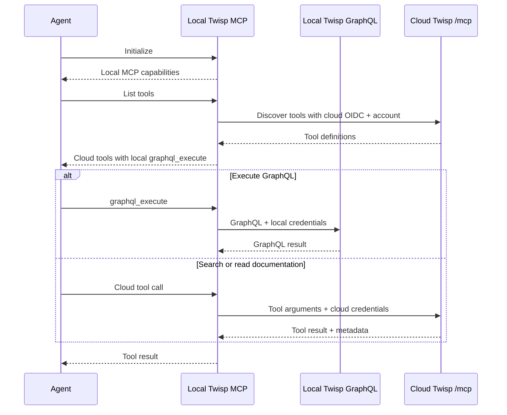

# twisp-mcp

A local MCP server that runs GraphQL directly against your Twisp instance and
forwards the other tools to Twisp's cloud MCP. It serves MCP over stdio, so your
agent launches it as a local process.



## Build

Requires **Go 1.25.5 or newer**. The MCP SDK is pinned to v1.0.0.

```bash
make build
make test
# Optional: install the binary into ~/bin
make install
```

Builds and tests need no AWS credentials, Bedrock access, Twisp service, or docs
corpus. Go downloads module dependencies on the first build. Tests use local
HTTP servers.

## Configure

GraphQL and cloud MCP have separate configuration. Cloud credentials are never
used as a fallback for GraphQL.

| Variable | Purpose | Default |
| --- | --- | --- |
| `TWISP_ENDPOINT` | Direct GraphQL endpoint | `http://localhost:8080/financial/v1/graphql` |
| `TWISP_ACCOUNT_ID` | GraphQL account | `000000000000` |
| `TWISP_BEARER_TOKEN` | Optional GraphQL bearer token | None |
| `TWISP_API_KEY` | Optional GraphQL API key, used when no bearer token is set | None |
| `TWISP_MCP_URL` | Cloud MCP endpoint | `https://api.us-east-1.dev.twisp.com/mcp` |
| `TWISP_MCP_ACCOUNT_ID` | Cloud tenant/account for authentication and search billing | Required for cloud tools |
| `TWISP_MCP_TOKEN_FILE` | File containing a cloud OIDC token, with or without `Bearer ` | None |
| `TWISP_MCP_BEARER_TOKEN` | Cloud OIDC token when no token file is configured | None |

Use `TWISP_MCP_TOKEN_FILE` for a long-running agent session. The file is read on
each cloud request; replace its contents when the token expires. A configured
file takes precedence over the environment token. The proxy does not mint or
refresh tokens itself. Do not check tokens into the repository.

For example, with local Twisp running and an existing dev token file:

```bash
export TWISP_MCP_ACCOUNT_ID=branch-1
export TWISP_MCP_TOKEN_FILE=/absolute/path/to/token.txt
./twisp-mcp
```

The process waits for MCP messages on stdin. Logs go to stderr. Run
`./twisp-mcp -version` to print the binary version.

Configure an MCP client to launch the binary with a configuration like:

```json
{
  "mcpServers": {
    "twisp": {
      "command": "/absolute/path/to/twisp-mcp",
      "env": {
        "TWISP_ENDPOINT": "http://localhost:8080/financial/v1/graphql",
        "TWISP_ACCOUNT_ID": "000000000000",
        "TWISP_MCP_URL": "https://api.us-east-1.dev.twisp.com/mcp",
        "TWISP_MCP_ACCOUNT_ID": "branch-1",
        "TWISP_MCP_TOKEN_FILE": "/absolute/path/to/token.txt"
      }
    }
  }
}
```

The cloud URL requires HTTPS, except for loopback HTTP servers used during local
development. Neither connection follows redirects. Endpoints and credentials
come from process configuration, never from tool arguments.

## Tool routing

`graphql_execute` always uses the local handler. It accepts `query`, optional
`variables` (an object or JSON string), and optional `operationName`. Its tool
description identifies the configured GraphQL endpoint. The endpoint can also
be a port forward or another Twisp instance reachable from your machine.
GraphQL requests and responses do not pass through the cloud MCP.

All other tools are discovered from the cloud, including their descriptions,
input/output schemas, and annotations. Today these include `search_schema`,
`search_docs`, `get_doc`, `search_examples`, and `get_example`. Their arguments,
results, errors, and result metadata are forwarded through the MCP SDK, which
supports JSON and SSE responses. Search embeddings and write-unit billing stay
in the cloud. The cloud's GraphQL tool is excluded and cannot be invoked through
the forwarding client.

The catalog refreshes on `tools/list`. Successful refreshes pick up additions,
changes, and removals. During an outage, the last successful catalog stays
available and cloud calls return tool errors. If the cloud is unavailable at
startup, only local GraphQL is listed; listing tools again retries discovery.
Local initialization and GraphQL calls do not require cloud connectivity.
Discovery has a five-second deadline and tool calls have a two-minute deadline.
Failed tool calls are not automatically replayed by this application.

Cloud docs and schema may describe a newer Twisp release than your local
instance. Check your local version when an example uses an unavailable field.
This is a tool proxy; it does not advertise cloud prompts or resources.

## Migration from 2.x

The existing `TWISP_*` GraphQL variables retain their meaning. Add the separate
`TWISP_MCP_*` variables for cloud tools. This version replaces the embedded
corpus and local Bleve indexes with cloud search; `make sync` is removed.
Offline GraphQL execution is supported, but offline documentation search is no
longer included. The former standalone implementation remains in git history.

## Development

```bash
go test -race ./...
go vet ./...
```

- `internal/server`: stdio MCP and tool registration/routing.
- `internal/cloud`: authenticated Streamable HTTP client, discovery, token files.
- `internal/graphql`: direct GraphQL HTTP client.
- `internal/tools`: local GraphQL tool definition and handler.
