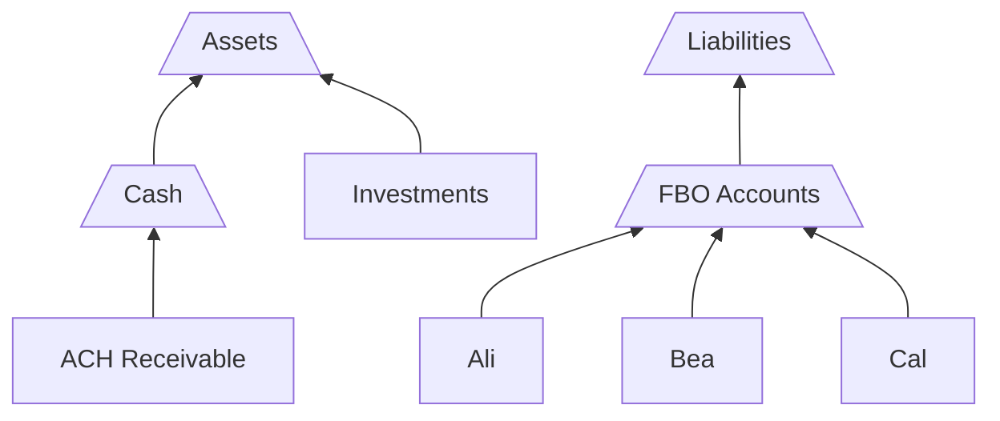

## Accounts Overview

[Accounts]($gql:object:Account) are a named **store of value** in that every account has a , as well as a **record of activity** in the form of ledger entries posted to them.

In Twisp, accounts record activity and materialize balances across multiple **layers** (see [Layered Accounting](/accounting-core/layered-accounting)) and have full support for multiple [Journals]($gql:object:Journal) Like every other record in the system, accounts are stored as immutable documents with all changes to them stored in a versioned history.

Say we had a wallet product. We can model each customer's wallet as an account, and the full collection of those accounts plus any other accounts we need to track money makes up our **chart of accounts**.

{% summary-table as="Account.SummaryTable" fields=["name", "drBalance", "crBalance", "normalBalance"] showHead=true data=[
  {
    "name": "Ali",
    "balance": {
      "available": {
        "drBalance": {
          "formatted": "$2.30"
        },
        "crBalance": {
          "formatted": "$9.20"
        },
        "normalBalance": {
          "formatted": "$6.90"
        }
      }
    }
  },
  {
    "name": "Bea",
    "balance": {
      "available": {
        "drBalance": {
          "formatted": "$5.00"
        },
        "crBalance": {
          "formatted": "$6.00"
        },
        "normalBalance": {
          "formatted": "$1.00"
        }
      }
    }
  },
  {
    "name": "Cal",
    "balance": {
      "available": {
        "drBalance": {
          "formatted": "$1.80"
        },
        "crBalance": {
          "formatted": "$8.50"
        },
        "normalBalance": {
          "formatted": "$6.70"
        }
      }
    }
  },
  {
    "name": "...",
    "balance": {
      "available": {
        "drBalance": {
          "formatted": "..."
        },
        "crBalance": {
          "formatted": "..."
        },
        "normalBalance": {
          "formatted": "..."
        }
      }
    }
  }
] /%}

## Organizing Accounts with Sets

Many accounting systems model the chart of accounts as a single hierarchical tree, with "parent" accounts and "child" or sub-accounts. This is especially useful to do things like roll up balances across multiple accounts. However, a single structure for _every_ account can be limiting, as some use cases call for multiple independent ways of organizing accounts.

In Twisp, we use a more flexible concept of [AccountSets]($gql:object:AccountSet), which are custom groups of accounts that aggregate balances and provide a unified interface into the entries for all accounts.

| Account Set | Accounts | Debit Balance | Credit Balance | Normal Balance |
|-------------|----------|---------------|----------------|----------------|
| A           | Ali, Cal | $4.10         | $17.70         | $13.60         |
| B           | Bea      | $5.00         | $6.00          | $1.00          |
| ...         | ...      | ...           | ...            | ...            |

One important feature of sets is that they can **contain other sets**. By nesting sets in this way, can model more complex structures for a chart of accounts.

Let's take the above accounts and imagine that they represent FBO accounts that we manage on behalf of our customers. With account sets, we could create a chart of accounts with these relationships:

In this chart, there are only four accounts: "ACH Receivable", "Investments", and the FBO accounts for Ali, Bea, and Cal. Organizing these accounts into various sets lets us materialize balances for different combinations of accounts.



Entries can only be posted to _accounts_, not to account _sets_.



## Balances Roll Up Entries

All accounts have corresponding [Balances]($gql:object:Balance) to summarize the amounts of entries posted to the account. For example, Bea's account could have the following entries:

| Amount | Direction | Posted On  |
|--------|-----------|------------|
| $4.00  | CREDIT    | 2022-09-15 |
| $2.00  | CREDIT    | 2022-09-19 |
| $5.00  | DEBIT     | 2022-09-20 |

Adding these up, we can see how her account reflects a **debit balance** of **$5.00** and a **credit balance** of **$6.00**, resulting in a **normal balance** of **$1.00**.

We can use account sets to roll up balances for different groupings of accounts. For example, if the "FBO Accounts" set corresponds the balance of a single account at a banking partner, it can be used to do reconciliation confirming that the balances of your FBO accounts match up to the balance shown by the bank.



The balance of account set X is alway equal to the sum of all entries posted to accounts in X plus the balances of all account sets in X.



To illustrate this concept, let's see how each of the account sets in the chart above would calculate their balances. To begin, we need to know the balances for all accounts. We'll focus here on just normal balances to keep things simple.

| Account        | Normal Balance |
|----------------|----------------|
| ACH Receivable | $14.60         |
| Investments    | $72.67         |
| Ali            | $6.90          |
| Bea            | $1.00          |
| Cal            | $6.70          |

Next, we can calculate each account set's balance by adding up the balances of its member accounts and account sets.

| Account Set  | Members           | Member Balances     | Account Set Balance |
|--------------|-------------------|---------------------|---------------------|
| Cash         | ACH Receivable    | $14.60              | $14.60              |
| FBO Accounts | Ali, Bea, Cal     | $6.90, $1.00, $6.70 | $14.60              |
| Assets       | Cash, Investments | $14.60, $72.67      | $82.27              |
| Liabilities  | FBO Accounts      | $14.60              | $14.60              |

## Credit Normal and Debit Normal

In double-entry accounting, accounts are often differentiated between "credit normal" and "debit normal". This means is that the balance for an account is either computed as `credits - debits` for credit normal accounts, and as `debits - credits` for debit normal accounts.

Debit normal accounts are often used for asset and expense account types where debits indicate money flowing _in_ to the account and thus _increasing_ its balance, and credits represent money flowing _out_ and _decreasing_ the balance. Credit normal accounts are often used for accounts which track things like revenue, liability, and equity where credits _increase_ the balance and debits _decrease_ the balance.



Read more about how account balances are calculated on the  page.



Twisp imposes no strict rules about which accounts can or should be credit or debit normal, as the design for a product ledger's chart of accounts will vary depending on the specifics needs of the product. Some users may decide to impose the standard 5 account types: assets, liabilities, expenses, revenue, and equity. Others may need a modified structure, or may only need credit normal accounts. The accounting core can structured to accommodate any variety.

## Creating Accounts

You can provision Twisp with a chart of accounts for a number of business use cases. Twisp can generate a chart of accounts suitable for representing economic activities for use cases such as:

- Digital Banking and Card Issuing
- Acquiring, Marketplace, Vertical SaaS
- Lending
- Currency Exchange



You have full control over the chart of accounts and can create new settlement and other accounts to represent your own funds flows.



An example of commonly-used accounts include a number of settlement accounts:

| Account              | Purpose                                                                                            |
|----------------------|----------------------------------------------------------------------------------------------------|
| Suspense Account     | The suspense account is posted to when transactions cannot be booked against a valid open account. |
| ACH Settlement       | The ACH settlement account for settling ACH transactions.                                          |
| Bill Pay Settlement  | An account for settling bill payments.                                                             |
| Checks               | Settlement account for checks that are posted to the system.                                       |
| ACH Reconciliation   | An account for ACH reconciliations losses                                                          |
| Charge off           | Accounts for charging off accounts that we’re closing due to losses.                               |
| Fraud Loss           | Fraud losses are booked here.                                                                      |
| Courtesy Credit      | Account used by customer service/experience for courtesy funds.                                    |
| Levies, garnishments | Account used for dealing with account levies and wage garnishments.                                |
| Card Disputes        | Account for issuing funds for card disputes.                                                       |
| ACH Disputes         | Account for ACH disputes.                                                                          |
