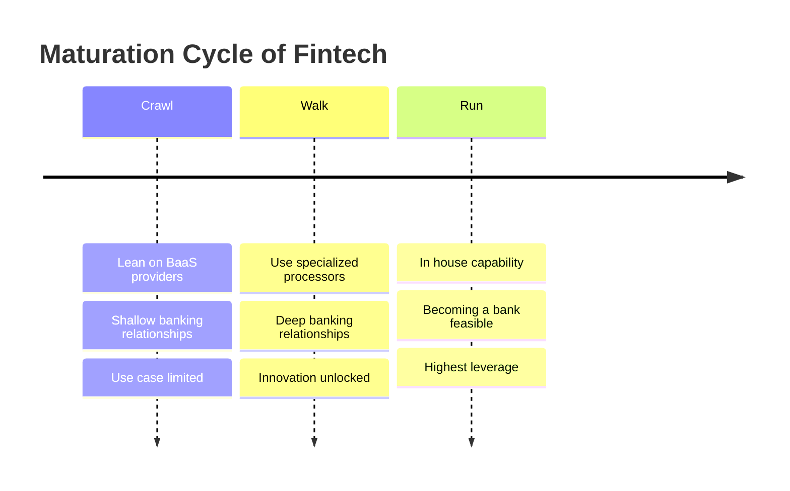
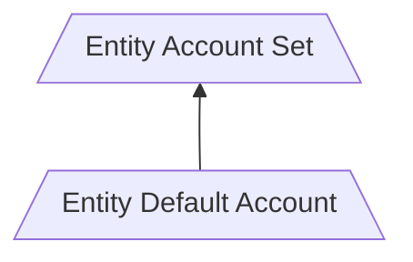
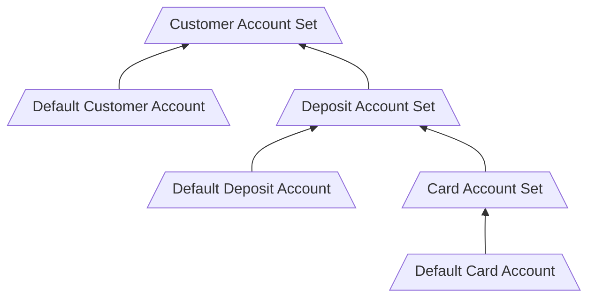
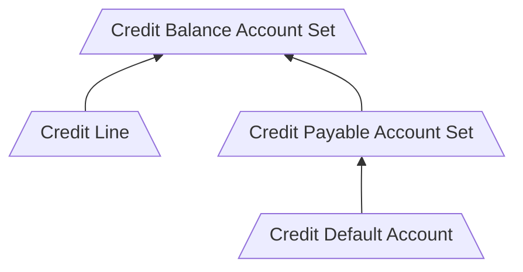

## Context

Organizations that offer financial products as part of their core product offering have a wide variety of service providers to bring products to market. There are vertical banking integrations such as Unit, which provide turn key treasury, lending and card operations. Other companies are  more specialized, card processors like Marqeta and Lithic and ACH and payments companies like Sila and Stripe.  As a company building on top of these service providers you're often going through a "Crawl, Walk, Run" maturation cycle:



The goal as a fintech is to prove your product and get to the "Run" stage as fast as possible.  One of the first systems you'll need to build and operate well is a core account system. Twisp is a core accounting system designed to provide a system of record for organizations that build financial products and services.  

In this document we'll dive into how to start modeling deposit accounts, credit accounts and their interaction with various payment instruments, which you'll find applicable to any stage of development.  

## Scope

In this document we'll cover:

1. Deposit and Credit accounts
3. Card transactions
4. ACH

We will design a number of "system level" accounts for operational and double entry accounting purposes. And we'll build out sample chart of accounts for a business neobanking vertical that we can iterate on toward your use case.

## Chart of Accounts

The chart of accounts in your fintech system is the building block for how you want balances to "roll up" for both end users and for your platform.  It is helpful to think of these charts as separate ones that interact with each other when funds are spent:  

1. **End User**: Track end user activity and control how balances "roll up" for end users of our system.
2. **Platform**: Track settlements, revenue and operational concerns of the platform.

### End User

We're going to cover two basic kinds of accounts:

- **Deposit Accounts**: DDA accounts are stores of value for banking customers. Debit instruments are hooked up to these accounts and these accounts are considered liabilities to the platform, because the platform owes the deposits to the account holders.
- **Credit Accounts**: Credit accounts are accounts with a line of credit (as we'll see later on, literally a line on an account) coupled with a payable account.  Customers will spend money and then they owe the account issuer funds back by a certain date, and the payable account accrues interest.

Twisp models both accounts similarly:

- An account set to represent the total balance of the account
- A default account to represent debits/credits incurred by the account holder

The difference between the two will be the [Balance Normality](/accounting-core/chart-of-accounts#credit-normal-and-debit-normal) of the accounts involved, and the credit accounts will have an extra account to hold the credit line.

#### Deposit Accounts

The chart of accounts for end users will model a `Customer -> Account -> Card` hiearchical relationship.  This hierarchical relationship we'll model via [Account Sets]($gql:object:AccountSet).  Each individual entity we'll create via a two objects as a building block for creating the chart of accounts:  

1. An [Account Set]($gql:object:AccountSet) to encapsulate the _total balance_ of the entity in question.
2. A default [Account]($gql:object:Account) as a member of the above account set for writing entries to the entity.



This building block can be encapsulated in via a GraphQL mutation:



Once we have this building block, we can now model the chart of accounts creating and adding to the appropriate account set.  

Consider the use case of onboarding a customer, followed by creating a deposit account and issuing a debit card; After onboarding we'd expect to have the following end user chart of accounts:  



The coordination of creating an account in Twisp can occur in many ways.  For example, it may be in response to webhooks from a BaaS provider:  

| Webhook Received   | Actions in Twisp                                           |
|--------------------|------------------------------------------------------------|
| `customer.created` | Create customer account                                    |
| `account.created`  | Create deposit account, add to customer account            |
| `card.created`     | Create card account, add to corresponding deposit account. |


Another might be creating Twisp entities via a state machine process, such as Temporal or Step Functions, coordinating activity with a number of vendors:  



This can be broken down into reusable pieces in case you want to add multiple deposit accounts or cards to a particular customer:  







Regardless of the mechanics of how/when new accounts are added, we suggest association of your own internal and third party identifiers on Twisp entities so that you can easily look up items in the future.  


Picking identifiers for Twisp and ensuring there is enough data in Twisp to look up by Unit identifiers, or your own system internal identifiers is paramount for keeping data consistent.  Twisp provides a few different mechanisms to aid in this:

- Accounts have an `externalId` field that will enforce uniqueness. 
- Accounts and Account Sets have a `metadata` field that's useful for populating with metadata from external systems, especially identifiers
- Utilize [UUID v5](https://www.sohamkamani.com/uuid-versions-explained/#v5-non-random-uuids) to generate deterministic identifiers for Twisp entities that correspond to their Unit counterparts.


#### Credit Accounts

Credit accounts are modeled slightly differently than deposit accounts:



In this case a second account, `Credit Line` is added. This account is where we book a single entry to define the limit of the entire credit account.  The other accounts function identically with the 
normality of the `Credit Payable` accounts being **Debit Normal**:

| Entry ID | Account | Amount | Direction | Credit Balance | Payable Balance |
|----------|---------|--------|-----------|----------------|-----------------|
| 1        | Line    | $1000  | Credit    | $1000          | $0              |
| 2        | Default | $500   | Debit     | $500           | $500            |
| 3        | Default | $250   | Credit    | $750           | $250            |
| 4        | Default | $10    | Debit     | $740           | $260            |

This gives you two significant balances:

1. The `Credit Balance` set gives you a balance that you can use for authorization decisions.
2. The `Credit Payable` set gives you a balance that is owed to you by the customer. 



### Platform Accounts

When operating a fintech, your organization will partner with a bank which will configure one or more actual bank accounts in order to support your operations. These include, but are not limited to:

| Account                 | Description                                                                             |
|-------------------------|-----------------------------------------------------------------------------------------|
| Suspense Account        | An account to post transactions with unknown accounts to.                               |
| ACH Settlement          | Settlement account for ACHs.                                                            |
| Bill Pay Settlement     | Settlement account for Bill Pay.                                                        |
| Foreign Checks Account  | Settlement account for foriegn checks.                                                  |
| Courtesy Credit Account | Operational accounts for crediting accounts via customer service interactions.          |
| Charge Off Account      | Operational account to write off closing balances on uncollectable accounts.            |
| Fraud Losses            | Operational account to write off losses for fraud.                                      |
| Levies & Garnishments   | Account to collect levies and garnishments of funds.                                    |
| Cashiers Check          | Settlement account for cashiers checks.                                                 |
| Card Disputes           | Reserve account for handling card related disputes.                                     |
| ACH Disputes            | Reserve account for handling ACH related disputes.                                      |
| Interchange Revenue     | Revenue account for shared  interchange.                                                |
| Collected Fee Revenue   | Revenue account for fees collected from accounts.                                       |
| FBO                     | "For Benefit Of", omnibus accounts for specific purpose.  For example, virtual wallets. |
| Cash                    | An asset account that represents all funds created in the system.                       |

These accounts are often the "other side" of your double entry accounting and you could have multiple of these accounts across your various banking partners.  For the purpose of this document, we'll consider a system with:

- Cash account for assets
- Card Settlement for a single BIN
- ACH Settlement account for single bank partner
- Suspense Account
- Disputes
- Revenue


There will be a few well known identifiers for these settlement accounts that will be pervasively used through the system.

We recommend creating a library with human readable codes that allow fast look ups to use as parameters to tran codes.





## Transaction Workflows

When processing transactions, to end users they feel like a singular event. I swipe my card the purchase is made.  However that singular event is often a series
of transactions, depending on how the swipe was made  (Dual vs Single message auth), or if the merchant uses multiple clearings.  Card processing can be challenging as 
the underlying protocol allows for a wide variety of behaviors.  

The same is true with many other types of transactions, such as ACH's or checks. The logically singular event may have a lifecycle that encompasses many transactions. These lifecycles we call 
transaction workflows and here we present a simplified model that you can adapt to your particular card and ach providers.

### Primitives

There are a few different primitives built into Twisp for posting transactions that will help us model these the workflows:  

- [Tran Codes](/accounting-core/encoded-transactions) define entries are posted for a particular transaction type.
- [postTransaction]($gql:mutation:postTransaction) allows you to post a transaction with a specific tran code.
- [voidTransaction]($gql:mutation:voidTransaction) posts the entries required to reverse any transaction.
- [workflows]($gql:mutation:workflows) allow composition of multiple transaction operations to fulfill specific use cases.

Each of these transaction flows will be composed together of one or more of the above primitives. These workflows are not prescriptive, but are intended to illustrate the concepts to the point where they can be adapted to your own use case and production usage.  

## Card Authorizations and Transactions

The ISO-8583 specification defines how merchants and issuers interact with each other via card networks.  This communication protocol is implemented by a wide variety of vendors, and for the 
purposes of this document we're going to explore the key workflows required, define the [tran codes](/accounting-core/encoded-transactions) required to post transaction and illustrate how to
utilize those tran codes to fulfill card authorization work flows.  

### Tran Codes

At the heart of processing transactions in Twisp are the Tran Codes required to make journal entries.  Here is a set of tran codes that allow you to completely model card authorization and settlement/clearing.  

| Code              | Description                                                 |
|-------------------|-------------------------------------------------------------|
| CARD_HOLD         | Post at pending layer between settlement and card accounts. |
| CARD_SETTLE       | Post at settled layer between settlement and card accounts. |
| CARD_HOLD_VOID    | Optional $0 entries at pending layer                        |
| CARD_HOLD_REPLACE | Identical to CARD_HOLD, but provides labeling differences   |
| CARD_DECLINE      | Optional $0 entries at pending layer for declines           |





### Card Authorization Workflows

Card flows in Twisp can be modeled entirely with `postTransaction` and `voidTransaction` which are the most common primitives you'll use in Twisp.  Together with the set of card tran codes, you can build out very simple card flows that allow you to accurately track the balances and entries required for a card transaction lifecycle.  

Using the account we onboarded earlier, we'll post the transactions for each use case and print the resulting balances.  

#### Authorization Approval

You receive an authorization request and/or an advice for $10 that an authorization was approved. 

| Event        | Operation       | Tran Code | Description                    |
|--------------|-----------------|-----------|--------------------------------|
| auth.request | postTransaction | CARD_HOLD | post $ amount to pending layer |
| auth.created | voidTransaction | n/a       | void previous transaction      |
| ...          | postTransaction | CARD_HOLD | post $ amount to pending layer |






#### Authorization Decline

You decide to decline an authorization request or receive an advice that an authorization was declined for $10.

| Event        | Operation       | Tran Code      | Description                                 |
|--------------|-----------------|----------------|---------------------------------------------|
| auth.created | postTransaction | CARD_HOLD      | post $ amount to pending layer              |
| ...          | check balance   | n/a            | balance exceeds threshold                   |
| ...          | voidTransaction | n/a            | void transaction                            |
| ...          | postTransaction | CARD_HOLD_VOID | optionally Post $0 entry indicating no hold |






#### Authorization Update

An authorization is approved for $10 and then updated to $1.

| Event        | Operation       | Tran Code         | Description                        |
|--------------|-----------------|-------------------|------------------------------------|
| auth.created | postTransaction | CARD_HOLD         | post $ amount to pending layer     |
| auth.update  | voidTransaction | n/a               | void prior transaction             |
| ...          | postTransaction | CARD_HOLD_REPLACE | post new $ amount to pending layer |






#### Authorization Cancelation

The authorization is created for $10 that expires or is canceled by the merchant.

| Event        | Operation       | Tran Code    | Description                                   |
|--------------|-----------------|--------------|-----------------------------------------------|
| auth.created | postTransaction | CARD_HOLD    | post $ amount to pending layer                |
| auth.cancel  | voidTransaction | n/a          | void prior transaction                        |






#### Settlement (amount >= auth)

A settlement of an existing authorization whose amount is greater than the hold amount.  In this case a $10 settlement is applied to the account.

| Event        | Operation       | Tran Code      | Description                                 |
|--------------|-----------------|----------------|---------------------------------------------|
| auth.created | postTransaction | CARD_HOLD      | post $ amount to pending layer              |
| tx.created   | postTransaction | CARD_SETTLE    | post $ amount to settled layer              |
| ...          | voidTransaction | n/a            | void prior authorization transaction        |
| ...          | postTransaction | CARD_HOLD_VOID | optionally Post $0 entry indicating no hold |





#### Multi-settlement (amount < auth)

Some processors always drop holds with a settlement. Others will adjust hold amount and allow for additional settlements. You'll map your implementation
to match the card providers.

| Event        | Operation       | Tran Code         | Description                                 |
|--------------|-----------------|-------------------|---------------------------------------------|
| auth.created | postTransaction | CARD_HOLD         | post $ amount to pending layer              |
| tx.created   | postTransaction | CARD_SETTLE       | post $ amount to settled layer              |
| ...          | voidTransaction | n/a               | void prior authorization transaction        |
| ...          | postTransaction | CARD_HOLD_VOID    | optionally Post $0 entry indicating no hold |
| auth.updated | voidTransaction | n/a               | optionally void prior $0 hold               |
| ...          | postTransaction | CARD_HOLD_REPLACE | optionally post new hold                    |





#### Settlement (no Auth)

Receive a transaction without a matching hold.

| Event        | Operation       | Tran Code   | Description                                 |
|--------------|-----------------|-------------|---------------------------------------------|
| tx.created   | postTransaction | CARD_SETTLE | post $ amount to settled layer              |





#### Return

Receive a return transaction.

| Event        | Operation       | Tran Code   | Description                                 |
|--------------|-----------------|-------------|---------------------------------------------|
| tx.created   | postTransaction | CARD_SETTLE | post $ amount to settled layer              |





## ACH

The Automated Clearing House is a service provided by the Federal Reserve for conducting electronic funds transfers.  There are two modes of operation when dealing with ACH:

- Receiving Deposit Financial Institution (RDFI): External FI's are crediting/debiting your accounts with theirs
- Originating Deposit Financial Institution (ODFI): You are initiating credits/debits with external accounts

Twisp has a number of built in tran codes and workflows to handle both use cases.

### Tran Codes



### Workflows

In addition to the built-in tran codes, Twisp offers a number of workflows that will post & void transactions as appropriate for each stage of the ACH transaction lifecycle.  These are built on top of the [executeTask]($gql:mutation:workflow.executeTask) workflow invocation.   

Below we will look at sample graphql for invocation of the workflow and describe the various tasks available for each type of workflow.  

#### ODFI Push

| Task          | Valid From             | Description                                                                                 |
|---------------|------------------------|---------------------------------------------------------------------------------------------|
| CREATE        |                        | Debit customers account at `PENDING` layer, funds leaving in next ACH batch.                |
| SUBMIT        | CREATE                 | Void the `PENDING` transaction and post settlement, funds are sent to external institution. |
| RETURN        | SUBMIT                 | External institution returned the funds for some reason. e.g. Account is closed.            |
| CANCEL        | CREATE                 | Cancel the ACH transaction before the batch window is reached.                              |
| CONTINUE      | CANCEL, REIMBURSE_FEE  | Undo the cancellation.                                                                      |
| REIMBURSE_FEE | CREATE, SUBMIT, RETURN | Reimburse optional fee to the customer.                                                                                            |




#### ODFI Pull

| State  | Valid From     | Description                                                                        |
|--------|----------------|------------------------------------------------------------------------------------|
| CREATE |                | Credit customer account from an external account at `ENCUMBRANCE` layer.           |
| CANCEL | CREATE         | Cancel transfer if before ACH batch cutoff.                                        |
| SUBMIT | CREATE         | Submit transfer in ACH file. Post at `PENDING` layer until settlement.             |
| SETTLE | SUBMIT         | After 3 days without return, post transfer to `SETTLED` layer.                     |
| RETURN | SUBMIT, SETTLE | If received a return, send funds from customer account back to settlement account. |




#### RDFI Credit

| State  | Valid From     | Description                                                     |
|--------|----------------|-----------------------------------------------------------------|
| CREATE |                | Creates an encumbrance credit, funds will deposit into account. |
| SETTLE | CREATE         | Funds are now settled.                                          |
| RETURN | SETTLE, CREATE | Returned funds to originating institution.                      |




#### RDFI Debit

| State  | Valid From     | Description                                                   |
|--------|----------------|---------------------------------------------------------------|
| CREATE |                | Creates and encumbrance debit, funds will debit from account. |
| SETTLE | CREATE         | Funds are now settled.                                        |
| RETURN | CREATE, SETTLE | Initiated a return, funds credit back to customer account.    |




## Clearing Settlements

The cash account is an important one for double entry accounting. This is account is the mechanism for getting money from the outside world into and out of your system.  In our case there are several accounts that may interact with the outside world and change the total cash position of the system:  

- Settlement Accounts 
  - Cards
  - ACH
- Revenue accounts
- Disputes and other operational accounts

These accounts will be "cleared" in bulk with the aggregate amount at the time of clearing.  Let's say you have $2M in card debits on a particular day across 2 transactions. Where your starting cash balance is $100M

| DR                 | CR              | Balances                    |
|--------------------|-----------------|-----------------------------|
| $2M Card Settle    | $2M Cash        | Card Settle ($2M), Cash $98 |
| $1M Deposit Acct 1 | $1M Card Settle | Card Settle($1M)            |
| $1m Deposit Acct 2 | $1M Card Settle | Card Settle $0              |


This bulk clearing to get funds on/off the platform should be conducted with it's own tran codes.  These settlement accounts are often backed by an account at a bank, and so the balances of these accounts should be reconciled with your representation of them in your accounting system.  



## Advanced Topics

As we've seen, Tran Codes are a powerful abstraction to encapsulate accounting concerns inside of Twisp.  We also explored one workflow that Twisp offers for ACH transactions, to automatically handle posting and voiding transactions to a customers account for each part of an ACH lifecycle.  

Twisp offers several other workflows that may be useful for interacting with the accounting core. In this section we'll briefly examine each one.  

### Void And Post Workflow

The Void and Post workflow is a powerful mechanism for modeling a transaction that may change layers and amounts over time.  In essence a single transaction identifier, the `executionId` passed to the workflow, will void the prior transaction created by the workflow and create a new transaction with the tran code you've provided to the workflow.

This allows for some powerful transaction modeling. Consider the earlier section on card holds. In that you may be composing together two graphql queries:

- `voidTransaction` to void the "prior authorization"
- `postTransaction` to post the new authorization value

With the void and post workflow, we can use a single identifier for the "authorization" and update it without needing to keep track of multiple transaction ids.  Consider this example which posts an authorization and then updates it.  



### States Language Workflow

GraphQL is an extremely expressive querying language, however sometimes it requires multiple interactions to serve a request. Take for example the card authorization use case:  

- Optimistically post transaction
- Check if any balances are violated
- Void if one of the balances is violated
- Indicate in response if transaction is Approved or Declined

There could possibly be 2-3 network calls to Twisp to fulfill this use case with just the GraphQL api interacting with your application. However, if you want to accomplish all of this _transactionally_ in Twisp, we support defining state machines using [States Language](https://states-language.net/) that allows you to cooridnate multiple api calls.  

In the following example: 

- post a `CARD_HOLD` optimistically to a card account
- check the balance of the parent deposit account set
- if the balance is less than zero we void
- return either a `Declined` or `Approved` message based on the balance


This feature is not yet GA but we're looking to ship in the next few days.




### Custom Balance Computations

By default Twisp rolls up balances on a number of dimensions:  

- journal
- account 
- currency

Twisp offers the ability to compute balances on additional dimensions. For example, often fintechs will put limits in per MCC code or perhaps on daily, weekly, monthly or yearly spending limits.  These are supported in Twisp via [Balance Calculations]($gql:mutation:createCalculation).  Once you've created a balance calcuation, you may look up balance on that calculation via the balances endpoint by supplying the `calculationId` and `dimension` values you're interested in. For example, for the above calculation:  

```graphql
query GetJan12020EffectiveBalance($accountId: UUID!) {
  balance(
    accountId: $accountId
    currency: "USD"
    calculationId: "5867b5dd-fc69-416c-80f5-62e8a53610d5" 
    dimension: {
        effectiveDate: "2020-01-01"
    }
  ) {
    available(layer:PENDING) {
        normalBalance {
            units
        }
    }
  }
}
```
