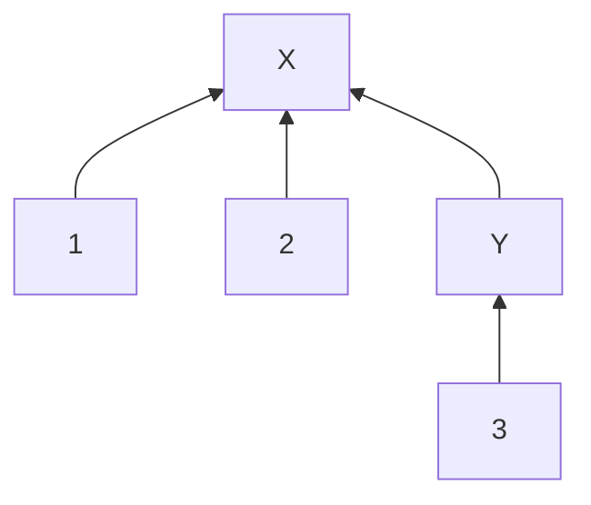

## The Basics

Account sets allow you to group and organize accounts within the Twisp Accounting Core, providing a structured way to manage and visualize your chart of accounts.



Account Sets are how you create **custom groupings of accounts** for better organization and **multi-account balance materializations**.



Instead of using a single hierarchical tree to model your chart of accounts, account sets offer a more dynamic approach. They are custom groups of accounts that aggregate balances and provide a unified interface into the entries for all accounts within the set.

## Components of Account Sets

There are 5 key components that make up account sets:

1. **Members**: either accounts or other account sets. This flexibility allows you to create more complex structures for your chart of accounts, as you can nest sets within other sets.
2. **Sets**: reference the other sets (if any) which contain this set as a member.
3. **Balances**: represent the sum of all balances of member accounts and member account sets. Balances are computed for every currency and layer used by the entries posted to accounts in a set and all of its sub-sets.
4. **Journal**: associates the account set with a specific journal. Account sets only compute balances using entries posted to their associated journal.
5. **Normal Balance Type**: determines how the account set's normal balances are computed, just like for accounts.

In addition, account sets have other properties which are common to most or all resources in the accounting core:

- **ID**: a universally unique identifier (UUID) for the account set.
- **Name**: a descriptive name to identify the account set.
- **Description**: a free-form text to be used for describing anything about the account set. We recommend using this field to summarize what the account set is for and when it should be used.
- **Metadata**: unstructured, user-specified JSON. Can be combined with custom indexes for powerful querying capacities.
- **Config**: allows setting up an account set for concurrent posting.
- **Created & Updated Timestamps**: self-evident: when the account set was created and when it was last updated.
- **Version & History**: account sets, like every other record in the accounting core, maintain a list of all changes made to them in their `history` field, and the `version` field indicates the current active version of the account set.

## Nesting and Hierarchies in Account Sets

Account sets in Twisp offer a flexible way to organize accounts into hierarchical structures. By nesting account sets within other account sets, complex structures can be modeled to better fit the needs of your business or organization.

Nesting account sets is as simple as using the `addToAccountSet` mutation and specifying the `memberType` as `ACCOUNT_SET`. Here's an example:

```graphql
mutation AddToAccountSetNested(
  addToAccountSet(
    id: "<ID for parent account set>"
    member: { memberId: "<ID of child account set>", memberType: ACCOUNT_SET }
  ) {
    accountSetId
    members(first: 10) {
      nodes {
        __typename
        ... on AccountSet {
          accountSetId
          name
        }
      }
    }
  }
)
```

By following this approach, you can create tree-like structures and organize accounts in a way that suits your specific use case.

Here's an example of a tree structure that can be created using nested account sets:



In this example, we have an account set "X" which contains account #1, account #2, and a nested account set "Y" which contains account #3.

## Account Set Operations

Use GraphQL queries and mutations to read, create, add members to, update, and delete (lock) account sets:

- [`Query.accountSet()`]($gql:query:accountSet): Get a single account set.
- [`Query.accountSets()`]($gql:query:accountSets): Query account sets using index filters.
- [`Mutation.createAccountSet()`]($gql:mutation:createAccountSet): Create a new account set.
- [`Mutation.addToAccountSet()`]($gql:mutation:addToAccountSet): Add a member (account or account set) to an existing account set.
- [`Mutation.removeFromAccountSet()`]($gql:mutation:removeFromAccountSet): Remove a member (account or account set) from an existing account set.
- [`Mutation.updateAccountSet()`]($gql:mutation:updateAccountSet): Update select fields for an existing account set.
- [`Mutation.deleteAccountSet()`]($gql:mutation:deleteAccountSet): Soft delete (lock) a specified account set.

## Further Reading

To learn how to work with account sets, see the tutorial on [](/tutorials/organizing-with-account-sets).

For more context on how and why Twisp uses account sets, see [](/accounting-core/chart-of-accounts).

To review the GraphQL docs for the `AccountSet` type, see []($gql:object:AccountSet).
