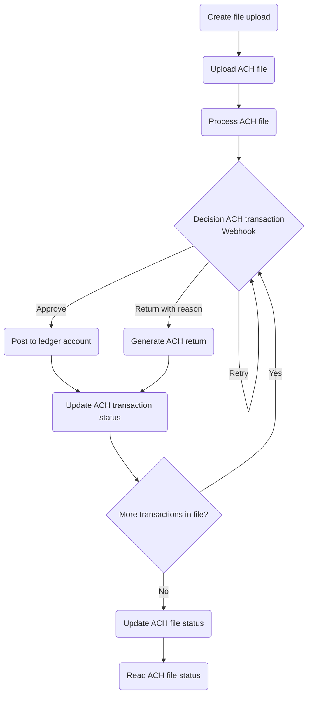
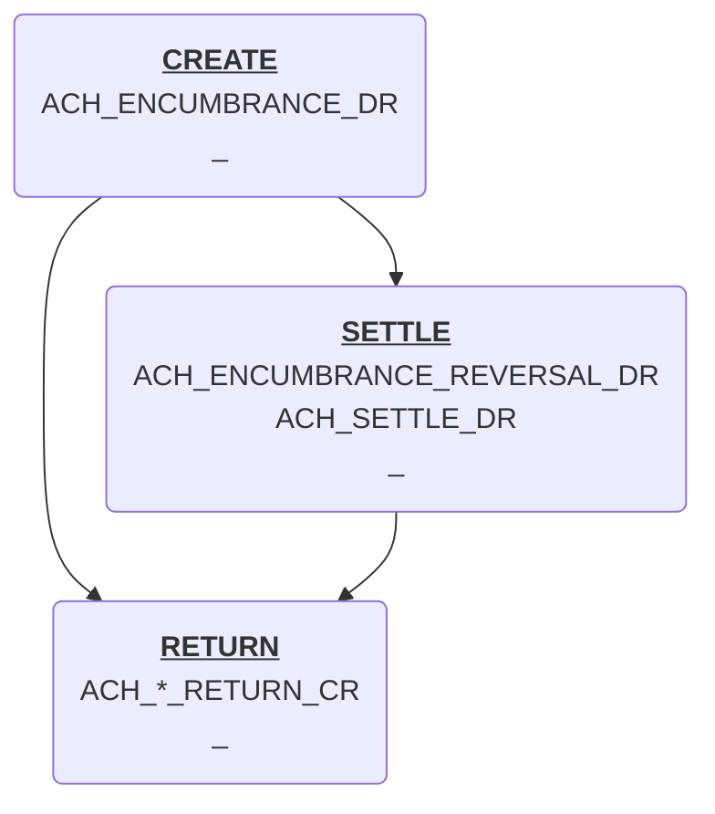

## The Basics

The ACH RDFI processor enables management of ACH transactions within the Twisp ledger system from the perspective of a Receiving Depository Financial Institution (RDFI). It provides endpoints for receiving ACH files, handling transaction postings, processing returns, managing reversals, and integrating these activities into the financial ledger.

The Automated Clearing House (ACH) network facilitates electronic financial transactions. An RDFI is responsible for receiving and processing incoming transactions, ensuring they are appropriately credited to beneficiary accounts while maintaining compliance with ACH rules and standards. This processor supports streamlined transaction management and regulatory adherence.



## ACH RDFI Workflow

### 0. Prerequisite ACH RDFI Config

An ACH config contains information for processing and generating ACH files.

You will need to create an endpoint for responding to processing requests:

```graphql
mutation CreateEndpoint {
  events {
    createEndpoint(
      input: {
        endpointId: "b84512f1-a67e-4dc2-94dd-66c48b4d13fb"
        status: ENABLED
        endpointType: ACH_PROCESSOR
        url: "https://webhook.site/ach-testing"
        subscription: []
        description: "ACH webhook processor"
      }
    ) {
      endpointId
    }
  }
}
```

Create the required accounts for processing ach transactions:

```graphql
mutation CreateAccounts {
  # ACH Settlement account
  settlement: createAccount(
    input:{
      accountId: "37f7e8a6-171f-411d-ad59-7b1f40f505ea"
      code: "settlement.ach"
      name: "ach settlement"
      normalBalanceType: DEBIT
      config: {
        enableConcurrentPosting: true
      }
    }
  ) {
    accountId
  }
  # Suspense/Exception Account
  suspenseAndException: createAccount(
    input:{
      accountId: "3171b0c2-6e9f-41aa-a5a6-ee927deb27cf"
      code: "suspense.ach"
      name: "ach suspense"
      config: {
        enableConcurrentPosting: true
      }
    }
  ) {
    accountId
  }
}
```

And then create a configuration that specifies the various accounts required for processing ACH files.



#### Accounts

1. `settlementAccountId` is the account that represents entries as they transit the system to end user or exception/expense accounts.
2. `exceptionAccountId` is the account that's posted to when a transaction fails to post to a customer account due to velocity controls, account state or some unknown reason.
3. `suspenseAccountId` is the account that's posted to when the desired account does not exist.

### 1. Upload ACH file

All RDFI ACH files received from the network must be uploaded. [`Mutation.files.createUpload()`](#) uploads a new ACH file containing transactions for processing.

```graphql
mutation CreateAchUpload{
  files {
    createUpload(
      input:{
        key: "nacha_file.ach"
        uploadType: ACH
        contentType: "text/plain"
      }
    ) {
      uploadURL
    }
  }
}
```

Example Upload of file with `curl`:

```
curl -T nacha_file.ach -XPUT '<uploadUrl>'
```

### 2. Process ACH file

After a file is uploaded, [`Mutation.ach.processFile()`]($gql:mutation:ach.processFile) will begin processing the uploaded ACH file.



### 3. Respond to ACH RDFI transaction webhooks

Webhooks will be triggered for all entries in the processed ACH file.

1. From the ACH entry details determine the `journalId` and `accountId` the transaction should be posted to.
1. Run any customer defined transaction checks to determine if a return is warranted.
1. Return a response for how Twisp should proceed in processing the transaction along with the timestamp for settlement.



#### Interaction with velocity limits

Something about how velocity limits are the end-all be-all of balance checking.

Learn more about velocity limits in ...



#### Sample webhooks

```json
{
  "workflowName": "ACH.RDFI.DR",
  "workflowTask": "CREATE",
  "executionId": "60f7ac42-ff72-48c7-af58-ee1f9a2db1e0",
  "fileHeader": {
    "id": "",
    "immediateDestination": "",
    "immediateOrigin": "",
    "fileCreationDate": "",
    "fileCreationTime": "",
    "fileIDModifier": "",
    "immediateDestinationName": "",
    "immediateOriginName": "",
    "referenceCode": ""
  },
  "batchHeader": {
    "id": "",
    "serviceClassCode": "",
    "companyName": "",
    "companyDiscretionaryData": "",
    "companyIdentification": "",
    "standardEntryClassCode": "",
    "companyEntryDescription": "",
    "companyDescriptiveDate": "",
    "effectiveEntryDate": "",
    "settlementDate": "",
    "originatorStatusCode": "",
    "odfiIdentification": "",
    "batchNumber": ""
  },
  "entryDetail": {
    "id": "",
    "transactionCode": "",
    "rdfiIdentification": "",
    "checkDigit": "",
    "dfiAccountNumber": "",
    "amount": "",
    "identificationNumber": "",
    "individualName": "",
    "discretionaryData": "",
    "addendaRecordIndicator": "",
    "traceNumber": "",
    "addenda02": {},
    "addenda05": {},
    "addenda98": {},
    "addenda98Refused": {},
    "addenda99": {},
    "addenda99Contested": {},
    "addenda99Dishonored": {},
    "category": ""
  }
}
```

```json
{
  "action": "SETTLE | RETURN | RETRY",
  "accountId": "d2f7183f-8e9c-45e7-9a98-ef1897ddb930",
  "when": "2024-01-01T23:20:50Z",
  "addenda99": {
    "returnCode": "R01",
    "dateOfDeath": "",
    "addendaInformation": ""
  },
  "metadata": {
    "key": "value"
  }
}
```

##### Example Responses

Where `now` is `2000-02-01T00:00:00.000Z`
Settle Now:
```json
{
  "action": "SETTLE",
  "accountId": "d2f7183f-8e9c-45e7-9a98-ef1897ddb930",
  "when": "2000-01-31T23:59:59.000Z",
  "metadata": {
    "key": "value"
  }
}
```

Settle in two days:
```json
{
  "action": "SETTLE",
  "accountId": "d2f7183f-8e9c-45e7-9a98-ef1897ddb930",
  "when": "2000-02-03T00:00:00.000Z",
  "metadata": {
    "key": "value"
  }
}
```

Settle based on settlement date defined in batch:
```json
{
  "action": "SETTLE",
  "accountId": "d2f7183f-8e9c-45e7-9a98-ef1897ddb930",
  "metadata": {
    "key": "value"
  }
}
```

Retry Twisp will exponentially backoff:
```json
{
  "action": "RETRY"
}
```

Decline with insufficient funds return code:
```json
{
  "action": "RETURN",
  "accountId": "d2f7183f-8e9c-45e7-9a98-ef1897ddb930",
  "addenda99": {
    "returnCode": "R01"
  },
  "metadata": {
    "key": "value"
  }
}
```


#### Return codes

| Code | Reason | Description |
|----|-----|------|
| `R01` | Insufficient Funds | Available balance is not sufficient to cover the dollar value of the debit entry |
| `R02` | Account Closed | Previously active account has been closed by customer or RDFI |
| `R03` | No Account/Unable to Locate Account | Account number structure is valid and passes editing process, but does not correspond to individual or is not an open account |
| `R04` | Invalid Account Number | Account number structure not valid; entry may fail check digit validation or may contain an incorrect number of digits. |
| `R05` | Improper Debit to Consumer Account | A CCD, CTX, or CBR debit entry was transmitted to a Consumer Account of the Receiver and was not authorized by the Receiver |
| `R06` | Returned per ODFI's Request | ODFI has requested RDFI to return the ACH entry (optional to RDFI - ODFI indemnifies RDFI) |
| `R07` | Authorization Revoked by Customer | Consumer, who previously authorized ACH payment, has revoked authorization from Originator (must be returned no later than 60 days from settlement date and customer must sign affidavit) |
| `R08` | Payment Stopped | Receiver of a recurring debit transaction has stopped payment to a specific ACH debit. RDFI should verify the Receiver's intent when a request for stop payment is made to insure this is not intended to be a revocation of authorization |
| `R09` | Uncollected Funds | Sufficient book or ledger balance exists to satisfy dollar value of the transaction, but the dollar value of transaction is in process of collection (i.e., uncollected checks) or cash reserve balance below dollar value of the debit entry. |
| `R10` | Customer Advises Originator is Not Known to Receiver and/or Originator is Not Authorized by Receiver to Debit Receiver’s Account | The receiver does not know the Originator’s identity and/or has not authorized the Originator to debit. Alternatively, for ARC, BOC, and POP entries, the signature is not authentic or authorized. |
| `R11` | Customer Advises Entry Not in Accordance with the Terms of the Authorization | The Originator and Receiver have a relationship, and an authorization to debit exists, but there is an error or defect in the payment such that the entry does not conform to the terms of the authorization. The Originator may correct the error and submit a new entry within 60 days of the return entry settlement date without the need for re-authorization by the Receiver. |
| `R12` | Branch Sold to Another DFI | Financial institution receives entry destined for an account at a branch that has been sold to another financial institution. |
| `R13` | RDFI not qualified to participate | Financial institution does not receive commercial ACH entries |
| `R14` | Representative payee deceased or unable to continue in that capacity | The representative payee authorized to accept entries on behalf of a beneficiary is either deceased or unable to continue in that capacity |
| `R15` | Beneficiary or bank account holder | (Other than representative payee) deceased* - (1) the beneficiary entitled to payments is deceased or (2) the bank account holder other than a representative payee is deceased |
| `R16` | Bank account frozen | Funds in bank account are unavailable due to action by RDFI or legal order |
| `R17` | File record edit criteria | Fields rejected by RDFI processing (identified in return addenda) |
| `R18` | Improper effective entry date | Entries have been presented prior to the first available processing window for the effective date. |
| `R19` | Amount field error | Improper formatting of the amount field |
| `R20` | Non-payment bank account | Entry destined for non-payment bank account defined by reg. |
| `R21` | Invalid company ID number | The company ID information not valid (normally CIE entries) |
| `R22` | Invalid individual ID number | Individual id used by receiver is incorrect (CIE entries) |
| `R23` | Credit entry refused by receiver | Receiver returned entry because minimum or exact amount not remitted, bank account is subject to litigation, or payment represents an overpayment, originator is not known to receiver or receiver has not authorized this credit entry to this bank account |
| `R24` | Duplicate entry | RDFI has received a duplicate entry |
| `R25` | Addenda error | Improper formatting of the addenda record information |
| `R26` | Mandatory field error | Improper information in one of the mandatory fields |
| `R27` | Trace number error | Original entry trace number is not valid for return entry; or addenda trace numbers do not correspond with entry detail record |
| `R28` | Transit routing number check digit error | Check digit for the transit routing number is incorrect |
| `R29` | Corporate customer advises not authorized | RDFI has been notified by corporate receiver that debit entry of originator is not authorized |
| `R30` | RDFI not participant in check truncation program | Financial institution not participating in automated check safekeeping application |
| `R31` | Permissible return entry (CCD and CTX only) | RDFI has been notified by the ODFI that it agrees to accept a CCD or CTX return entry |
| `R32` | RDFI non-settlement | RDFI is not able to settle the entry |
| `R33` | Return of XCK entry | RDFI determines at its sole discretion to return an XCK entry; an XCK return entry may be initiated by midnight of the sixtieth day following the settlement date if the XCK entry |
| `R34` | Limited participation RDFI | RDFI participation has been limited by a federal or state supervisor |
| `R35` | Return of improper debit entry | ACH debit not permitted for use with the CIE standard entry class code (except for reversals) |
| `R37` | Source Document Presented for Payment (Adjustment Entry) | The source document to which an ARC, BOC or POP entry relates has been presented for payment. RDFI must obtain a Written Statement and return the entry within 60 days following Settlement Date |
| `R38` | Stop Payment on Source Document (Adjustment Entry) | A stop payment has been placed on the source document to which the ARC or BOC entry relates. RDFI must return no later than 60 days following Settlement Date. No Written Statement is required as the original stop payment form covers the return |
| `R39` | Improper Source Document | The RDFI has determined the source document used for the ARC, BOC or POP entry to its Receiver's account is improper. |

#### Used for ENR entries and are initiated by a Federal Government Agency

| Code | Reason | Description |
|----|-----|------|
| `R40` | Return of ENR Entry by Federal Government Agency (ENR Only) | This return reason code may only be used to return ENR entries and is at the federal Government Agency's Sole discretion |
| `R41` | Invalid Transaction Code (ENR only) | Either the Transaction Code included in Field 3 of the Addenda Record does not conform to the ACH Record Format Specifications contained in Appendix Three (ACH Record Format Specifications) or it is not appropriate with regard to an Automated Enrollment Entry. |
| `R42` | Routing Number/Check Digit Error (ENR Only) | The Routing Number and the Check Digit included in Field 3 of the Addenda Record is either not a valid number or it does not conform to the Modulus 10 formula. |
| `R43` | Invalid DFI Account Number (ENR Only) | The Receiver's account number included in Field 3 of the Addenda Record must include at least one alphameric character. |
| `R44` | Invalid Individual ID Number/Identification Number (ENR only) | The Individual ID Number/Identification Number provided in Field 3 of the Addenda Record does not match a corresponding ID number in the Federal Government Agency's records. |
| `R45` | Invalid Individual Name/Company Name (ENR only) | The name of the consumer or company provided in Field 3 of the Addenda Record either does not match a corresponding name in the Federal Government Agency's records or fails to include at least one alphameric character. |
| `R46` | Invalid Representative Payee Indicator (ENR Only) | The Representative Payee Indicator Code included in Field 3 of the Addenda Record has been omitted or it is not consistent with the Federal Government Agency's records. |
| `R47` | Duplicate Enrollment (ENR Only) | The Entry is a duplicate of an Automated Enrollment Entry previously initiated by a DFI. |

#### Used for RCK entries only and are initiated by an RDFI

| Code | Reason | Description |
|----|-----|------|
| `R50` | State Law Affecting RCK Acceptance | RDFI is located in a state that has not adopted Revised Article 4 of the UCC or the RDFI is located in a state that requires all canceled checks to be returned within the periodic statement |
| `R51` | Item Related to RCK Entry is Ineligible or RCK Entry is Improper | The item to which the RCK entry relates was not eligible, Originator did not provide notice of the RCK policy, signature on the item was not genuine, the item has been altered or amount of the entry was not accurately obtained from the item. RDFI must obtain a Written Statement and return the entry within 60 days following Settlement Date |
| `R52` | Stop Payment on Item (Adjustment Entry) | A stop payment has been placed on the item to which the RCK entry relates. RDFI must return no later than 60 days following Settlement Date. No Written Statement is required as the original stop payment form covers the return. |
| `R53` | Item and RCK Entry Presented for Payment (Adjustment Entry) | Both the RCK entry and check have been presented for payment. RDFI must obtain a Written Statement and return the entry within 60 days following Settlement Date |

#### Used by the ODFI for dishonored return entries

| Code | Reason | Description |
|----|-----|------|
| `R61` | Misrouted Return | The financial institution preparing the Return Entry (the RDFI of the original Entry) has placed the incorrect Routing Number in the Receiving DFI Identification field. |
| `R67` | Duplicate Return | The ODFI has received more than one Return for the same Entry. |
| `R68` | Untimely Return | The Return Entry has not been sent within the time frame established by these Rules. |
| `R69` | Field Error(s) | One or more of the field requirements are incorrect. |
| `R70` | Permissible Return Entry Not Accepted/Return Not Requested by ODFI | The ODFI has received a Return Entry identified by the RDFI as being returned with the permission of, or at the request of, the ODFI, but the ODFI has not agreed to accept the Entry or has not requested the return of the Entry. |

#### Used by the RDFI for contested dishonored return entries

| Code | Reason | Description |
|----|-----|------|
| `R71` | Misrouted Dishonored Return | The financial institution preparing the dishonored Return Entry (the ODFI of the original Entry) has placed the incorrect Routing Number in the Receiving DFI Identification field. |
| `R72` | Untimely Dishonored Return | The dishonored Return Entry has not been sent within the designated time frame. |
| `R73` | Timely Original Return | The RDFI is certifying that the original Return Entry was sent within the time frame designated in these Rules. |
| `R74` | Corrected Return | The RDFI is correcting a previous Return Entry that was dishonored using Return Reason Code R69 (Field Error(s)) because it contained incomplete or incorrect information. |
| `R75` | Return Not a Duplicate | The Return Entry was not a duplicate of an Entry previously returned by the RDFI. |
| `R76` | No Errors Found | The original Return Entry did not contain the errors indicated by the ODFI in the dishonored Return Entry. |

#### Used by Gateways for the return of international payments

| Code | Reason | Description |
|----|-----|------|
| `R80` | IAT Entry Coding Error | The IAT Entry is being returned due to one or more of the following conditions: Invalid DFI/Bank Branch Country Code, invalid DFI/Bank Identification Number Qualifier, invalid Foreign Exchange Indicator, invalid ISO Originating Currency Code, invalid ISO Destination Currency Code, invalid ISO Destination Country Code, invalid Transaction Type Code |
| `R81` | Non-Participant in IAT Program | The IAT Entry is being returned because the Gateway does not have an agreement with either the ODFI or the Gateway's customer to transmit Outbound IAT Entries. |
| `R82` | Invalid Foreign Receiving DFI Identification | The reference used to identify the Foreign Receiving DFI of an Outbound IAT Entry is invalid. |
| `R83` | Foreign Receiving DFI Unable to Settle | The IAT Entry is being returned due to settlement problems in the foreign payment system. |
| `R84` | Entry Not Processed by Gateway | For Outbound IAT Entries, the Entry has not been processed and is being returned at the Gateway's discretion because either (1) the processing of such Entry may expose the Gateway to excessive risk, or (2) the foreign payment system does not support the functions needed to process the transaction. |
| `R85` | Incorrectly Coded Outbound International Payment | The RDFI/Gateway has identified the Entry as an Outbound international payment and is returning the Entry because it bears an SEC Code that lacks information required by the Gateway for OFAC compliance. |

### 4. Generate an ACH Return File

When RDFI file transaction processing is complete, a return file can be generated.

```graphql
mutation GenerateAchReturnFile{
  ach {
    generateFile(
      input:{
        configId: "b96d358e-50b8-4ae5-8b07-2e8f33f396c6"
        key: "nacha_file_return.ach"
        type: RDFI_RETURN
      }
    ) {
      key
    }
  }
}
```

### 5. Download ACH Return File

```graphql
mutation DownloadAchReturn {
  files {
    createDownload(key: "nacha_file_return.ach") {
      downloadURL
    }
  }
}
```

## Journal Posting Lifecycle

All ACH transactions are managed via workflows. Each individual ACH transaction is assigned a fixed `executionId` and state transitions on those tasks are ran by the ACH RDFI processor. Each state transition may post one or more transactions.



Workflows allow you to easily observe all historical actions taken on a particular `executionId`.

Learn more about workflows in ...




### Workflows

The following workflows are utilized in the ACH RDFI processor.

#### ACH RDFI Debit



#### ACH RDFI Credit


### TranCodes

```json
{
  "data": {
    "1": {
      "code": "SYS_ACH_ENCUMBRANCE_CANCEL_DR",
      "params": [
        {
          "name": "accountId",
          "type": "UUID",
          "description": "The account to place the hold on.",
        },
        {
          "name": "settlementAccountId",
          "type": "UUID",
          "description": "The settlement account to use.",
        },
        {
          "name": "feeAccountId",
          "type": "UUID",
          "description": "Optional fee account to use.",
          "default": "00000000-0000-0000-0000-000000000000"
        },
        {
          "name": "feeAmount",
          "type": "STRING",
          "description": "Optional decimal amount of the fee.",
          "default": "0"
        },
        {
          "name": "journalId",
          "type": "UUID",
          "description": "The journal to post transactions to.",
        },
        {
          "name": "amount",
          "type": "STRING",
          "description": "The decimal amount.",
        },
        {
          "name": "correlationId",
          "type": "STRING",
          "description": "Correlation identifier to group related transactions.",
        },
        {
          "name": "effective",
          "type": "DATE",
          "description": "Effective date for the transaction.",
        },
        {
          "name": "metadata",
          "type": "JSON",
          "description": "Metadata to attach to transaction.",
          "default": "{}"
        }
      ],
      "transaction": {
        "effective": "params.effective",
        "journalId": "params.journalId",
        "correlationId": "params.correlationId",
        "externalId": "''",
        "description": "''",
        "metadata": "params.metadata"
      },
      "entries": [
        {
          "entryType": "'ACH_ENCUMBRANCE_CANCEL_DR'",
          "accountId": "uuid(params.accountId)",
          "layer": "ENCUMBRANCE",
          "direction": "DEBIT",
          "units": "params.amount",
          "currency": "'USD'",
          "description": "''",
          "metadata": "{}",
        },
        {
          "entryType": "'ACH_ENCUMBRANCE_CANCEL_CR'",
          "accountId": "uuid(params.settlementAccountId)",
          "layer": "ENCUMBRANCE",
          "direction": "CREDIT",
          "units": "params.amount",
          "currency": "'USD'",
          "description": "''",
          "metadata": "{}",
        }
      ]
    },
    "2": {
      "code": "SYS_ACH_ENCUMBRANCE_CANCEL_REVERSAL_CR",
      "params": [
        {
          "name": "accountId",
          "type": "UUID",
          "description": "The account to place the hold on.",
        },
        {
          "name": "settlementAccountId",
          "type": "UUID",
          "description": "The settlement account to use.",
        },
        {
          "name": "feeAccountId",
          "type": "UUID",
          "description": "Optional fee account to use.",
          "default": "00000000-0000-0000-0000-000000000000"
        },
        {
          "name": "feeAmount",
          "type": "STRING",
          "description": "Optional decimal amount of the fee.",
          "default": "0"
        },
        {
          "name": "journalId",
          "type": "UUID",
          "description": "The journal to post transactions to.",
        },
        {
          "name": "amount",
          "type": "STRING",
          "description": "The decimal amount.",
        },
        {
          "name": "correlationId",
          "type": "STRING",
          "description": "Correlation identifier to group related transactions.",
        },
        {
          "name": "effective",
          "type": "DATE",
          "description": "Effective date for the transaction.",
        },
        {
          "name": "metadata",
          "type": "JSON",
          "description": "Metadata to attach to transaction.",
          "default": "{}"
        },
        {
          "name": "settleOn",
          "type": "TIMESTAMP",
          "description": "settleOn timestamp for ACH settlements.",
          "default": "1970-01-01T00:00:00Z"
        }
      ],
      "transaction": {
        "effective": "params.effective",
        "journalId": "params.journalId",
        "correlationId": "params.correlationId",
        "externalId": "''",
        "description": "''",
        "metadata": "params.metadata"
      },
      "entries": [
        {
          "entryType": "'ACH_ENCUMBRANCE_CANCEL_CR'",
          "accountId": "uuid(params.accountId)",
          "layer": "ENCUMBRANCE",
          "direction": "CREDIT",
          "units": "params.amount",
          "currency": "'USD'",
          "description": "''",
          "metadata": "{}",
        },
        {
          "entryType": "'ACH_ENCUMBRANCE_CANCEL_DR'",
          "accountId": "uuid(params.settlementAccountId)",
          "layer": "ENCUMBRANCE",
          "direction": "DEBIT",
          "units": "params.amount",
          "currency": "'USD'",
          "description": "''",
          "metadata": "{}",
        }
      ]
    },
    "3": {
      "code": "SYS_ACH_ENCUMBRANCE_CR",
      "params": [
        {
          "name": "accountId",
          "type": "UUID",
          "description": "The account to place the hold on.",
        },
        {
          "name": "settlementAccountId",
          "type": "UUID",
          "description": "The settlement account to use.",
        },
        {
          "name": "feeAccountId",
          "type": "UUID",
          "description": "Optional fee account to use.",
          "default": "00000000-0000-0000-0000-000000000000"
        },
        {
          "name": "feeAmount",
          "type": "STRING",
          "description": "Optional decimal amount of the fee.",
          "default": "0"
        },
        {
          "name": "journalId",
          "type": "UUID",
          "description": "The journal to post transactions to.",
        },
        {
          "name": "amount",
          "type": "STRING",
          "description": "The decimal amount.",
        },
        {
          "name": "correlationId",
          "type": "STRING",
          "description": "Correlation identifier to group related transactions.",
        },
        {
          "name": "effective",
          "type": "DATE",
          "description": "Effective date for the transaction.",
        },
        {
          "name": "metadata",
          "type": "JSON",
          "description": "Metadata to attach to transaction.",
          "default": "{}"
        },
        {
          "name": "settleOn",
          "type": "TIMESTAMP",
          "description": "settleOn timestamp for ACH settlements.",
          "default": "1970-01-01T00:00:00Z"
        }
      ],
      "transaction": {
        "effective": "params.effective",
        "journalId": "params.journalId",
        "correlationId": "params.correlationId",
        "externalId": "''",
        "description": "''",
        "metadata": "params.metadata"
      },
      "entries": [
        {
          "entryType": "'ACH_ENCUMBRANCE_CR'",
          "accountId": "uuid(params.accountId)",
          "layer": "ENCUMBRANCE",
          "direction": "CREDIT",
          "units": "params.amount",
          "currency": "'USD'",
          "description": "''",
          "metadata": "{}",
        },
        {
          "entryType": "'ACH_ENCUMBRANCE_DR'",
          "accountId": "uuid(params.settlementAccountId)",
          "layer": "ENCUMBRANCE",
          "direction": "DEBIT",
          "units": "params.amount",
          "currency": "'USD'",
          "description": "''",
          "metadata": "{}",
        }
      ]
    },
    "4": {
      "code": "SYS_ACH_ENCUMBRANCE_DR",
      "params": [
        {
          "name": "accountId",
          "type": "UUID",
          "description": "The account to place the hold on.",
        },
        {
          "name": "settlementAccountId",
          "type": "UUID",
          "description": "The settlement account to use.",
        },
        {
          "name": "feeAccountId",
          "type": "UUID",
          "description": "Optional fee account to use.",
          "default": "00000000-0000-0000-0000-000000000000"
        },
        {
          "name": "feeAmount",
          "type": "STRING",
          "description": "Optional decimal amount of the fee.",
          "default": "0"
        },
        {
          "name": "journalId",
          "type": "UUID",
          "description": "The journal to post transactions to.",
        },
        {
          "name": "amount",
          "type": "STRING",
          "description": "The decimal amount.",
        },
        {
          "name": "correlationId",
          "type": "STRING",
          "description": "Correlation identifier to group related transactions.",
        },
        {
          "name": "effective",
          "type": "DATE",
          "description": "Effective date for the transaction.",
        },
        {
          "name": "metadata",
          "type": "JSON",
          "description": "Metadata to attach to transaction.",
          "default": "{}"
        },
        {
          "name": "settleOn",
          "type": "TIMESTAMP",
          "description": "settleOn timestamp for ACH settlements.",
          "default": "1970-01-01T00:00:00Z"
        }
      ],
      "transaction": {
        "effective": "params.effective",
        "journalId": "params.journalId",
        "correlationId": "params.correlationId",
        "externalId": "''",
        "description": "''",
        "metadata": "params.metadata"
      },
      "entries": [
        {
          "entryType": "'ACH_ENCUMBRANCE_DR'",
          "accountId": "uuid(params.accountId)",
          "layer": "ENCUMBRANCE",
          "direction": "DEBIT",
          "units": "params.amount",
          "currency": "'USD'",
          "description": "''",
          "metadata": "{}",
        },
        {
          "entryType": "'ACH_ENCUMBRANCE_CR'",
          "accountId": "uuid(params.settlementAccountId)",
          "layer": "ENCUMBRANCE",
          "direction": "CREDIT",
          "units": "params.amount",
          "currency": "'USD'",
          "description": "''",
          "metadata": "{}",
        }
      ]
    },
    "5": {
      "code": "SYS_ACH_ENCUMBRANCE_RETURN_DR",
      "params": [
        {
          "name": "accountId",
          "type": "UUID",
          "description": "The account to place the hold on.",
        },
        {
          "name": "settlementAccountId",
          "type": "UUID",
          "description": "The settlement account to use.",
        },
        {
          "name": "feeAccountId",
          "type": "UUID",
          "description": "Optional fee account to use.",
          "default": "00000000-0000-0000-0000-000000000000"
        },
        {
          "name": "feeAmount",
          "type": "STRING",
          "description": "Optional decimal amount of the fee.",
          "default": "0"
        },
        {
          "name": "journalId",
          "type": "UUID",
          "description": "The journal to post transactions to.",
        },
        {
          "name": "amount",
          "type": "STRING",
          "description": "The decimal amount.",
        },
        {
          "name": "correlationId",
          "type": "STRING",
          "description": "Correlation identifier to group related transactions.",
        },
        {
          "name": "effective",
          "type": "DATE",
          "description": "Effective date for the transaction.",
        },
        {
          "name": "metadata",
          "type": "JSON",
          "description": "Metadata to attach to transaction.",
          "default": "{}"
        },
        {
          "name": "settleOn",
          "type": "TIMESTAMP",
          "description": "settleOn timestamp for ACH settlements.",
          "default": "1970-01-01T00:00:00Z"
        }
      ],
      "transaction": {
        "effective": "params.effective",
        "journalId": "params.journalId",
        "correlationId": "params.correlationId",
        "externalId": "''",
        "description": "''",
        "metadata": "params.metadata"
      },
      "entries": [
        {
          "entryType": "'ACH_ENCUMBRANCE_RETURN_DR'",
          "accountId": "uuid(params.accountId)",
          "layer": "ENCUMBRANCE",
          "direction": "DEBIT",
          "units": "params.amount",
          "currency": "'USD'",
          "description": "''",
          "metadata": "{}",
        },
        {
          "entryType": "'ACH_ENCUMBRANCE_RETURN_CR'",
          "accountId": "uuid(params.settlementAccountId)",
          "layer": "ENCUMBRANCE",
          "direction": "CREDIT",
          "units": "params.amount",
          "currency": "'USD'",
          "description": "''",
          "metadata": "{}",
        }
      ]
    },
    "6": {
      "code": "SYS_ACH_ENCUMBRANCE_RETURN_CR",
      "params": [
        {
          "name": "accountId",
          "type": "UUID",
          "description": "The account to place the hold on.",
        },
        {
          "name": "settlementAccountId",
          "type": "UUID",
          "description": "The settlement account to use.",
        },
        {
          "name": "feeAccountId",
          "type": "UUID",
          "description": "Optional fee account to use.",
          "default": "00000000-0000-0000-0000-000000000000"
        },
        {
          "name": "feeAmount",
          "type": "STRING",
          "description": "Optional decimal amount of the fee.",
          "default": "0"
        },
        {
          "name": "journalId",
          "type": "UUID",
          "description": "The journal to post transactions to.",
        },
        {
          "name": "amount",
          "type": "STRING",
          "description": "The decimal amount.",
        },
        {
          "name": "correlationId",
          "type": "STRING",
          "description": "Correlation identifier to group related transactions.",
        },
        {
          "name": "effective",
          "type": "DATE",
          "description": "Effective date for the transaction.",
        },
        {
          "name": "metadata",
          "type": "JSON",
          "description": "Metadata to attach to transaction.",
          "default": "{}"
        },
        {
          "name": "settleOn",
          "type": "TIMESTAMP",
          "description": "settleOn timestamp for ACH settlements.",
          "default": "1970-01-01T00:00:00Z"
        }
      ],
      "transaction": {
        "effective": "params.effective",
        "journalId": "params.journalId",
        "correlationId": "params.correlationId",
        "externalId": "''",
        "description": "''",
        "metadata": "params.metadata"
      },
      "entries": [
        {
          "entryType": "'ACH_ENCUMBRANCE_RETURN_CR'",
          "accountId": "uuid(params.accountId)",
          "layer": "ENCUMBRANCE",
          "direction": "CREDIT",
          "units": "params.amount",
          "currency": "'USD'",
          "description": "''",
          "metadata": "{}",
        },
        {
          "entryType": "'ACH_ENCUMBRANCE_RETURN_DR'",
          "accountId": "uuid(params.settlementAccountId)",
          "layer": "ENCUMBRANCE",
          "direction": "DEBIT",
          "units": "params.amount",
          "currency": "'USD'",
          "description": "''",
          "metadata": "{}",
        }
      ]
    },
    "7": {
      "code": "SYS_ACH_ENCUMBRANCE_REVERSAL_DR",
      "params": [
        {
          "name": "accountId",
          "type": "UUID",
          "description": "The account to place the hold on.",
        },
        {
          "name": "settlementAccountId",
          "type": "UUID",
          "description": "The settlement account to use.",
        },
        {
          "name": "feeAccountId",
          "type": "UUID",
          "description": "Optional fee account to use.",
          "default": "00000000-0000-0000-0000-000000000000"
        },
        {
          "name": "feeAmount",
          "type": "STRING",
          "description": "Optional decimal amount of the fee.",
          "default": "0"
        },
        {
          "name": "journalId",
          "type": "UUID",
          "description": "The journal to post transactions to.",
        },
        {
          "name": "amount",
          "type": "STRING",
          "description": "The decimal amount.",
        },
        {
          "name": "correlationId",
          "type": "STRING",
          "description": "Correlation identifier to group related transactions.",
        },
        {
          "name": "effective",
          "type": "DATE",
          "description": "Effective date for the transaction.",
        },
        {
          "name": "metadata",
          "type": "JSON",
          "description": "Metadata to attach to transaction.",
          "default": "{}"
        },
        {
          "name": "settleOn",
          "type": "TIMESTAMP",
          "description": "settleOn timestamp for ACH settlements.",
          "default": "1970-01-01T00:00:00Z"
        }
      ],
      "transaction": {
        "effective": "params.effective",
        "journalId": "params.journalId",
        "correlationId": "params.correlationId",
        "externalId": "''",
        "description": "''",
        "metadata": "params.metadata"
      },
      "entries": [
        {
          "entryType": "'ACH_ENCUMBRANCE_REVERSAL_DR'",
          "accountId": "uuid(params.accountId)",
          "layer": "ENCUMBRANCE",
          "direction": "DEBIT",
          "units": "decimal.Neg(params.amount)",
          "currency": "'USD'",
          "description": "''",
          "metadata": "{}",
        },
        {
          "entryType": "'ACH_ENCUMBRANCE_REVERSAL_CR'",
          "accountId": "uuid(params.settlementAccountId)",
          "layer": "ENCUMBRANCE",
          "direction": "CREDIT",
          "units": "decimal.Neg(params.amount)",
          "currency": "'USD'",
          "description": "''",
          "metadata": "{}",
        }
      ]
    },
    "8": {
      "code": "SYS_ACH_ENCUMBRANCE_REVERSAL_CR",
      "params": [
        {
          "name": "accountId",
          "type": "UUID",
          "description": "The account to place the hold on.",
        },
        {
          "name": "settlementAccountId",
          "type": "UUID",
          "description": "The settlement account to use.",
        },
        {
          "name": "feeAccountId",
          "type": "UUID",
          "description": "Optional fee account to use.",
          "default": "00000000-0000-0000-0000-000000000000"
        },
        {
          "name": "feeAmount",
          "type": "STRING",
          "description": "Optional decimal amount of the fee.",
          "default": "0"
        },
        {
          "name": "journalId",
          "type": "UUID",
          "description": "The journal to post transactions to.",
        },
        {
          "name": "amount",
          "type": "STRING",
          "description": "The decimal amount.",
        },
        {
          "name": "correlationId",
          "type": "STRING",
          "description": "Correlation identifier to group related transactions.",
        },
        {
          "name": "effective",
          "type": "DATE",
          "description": "Effective date for the transaction.",
        },
        {
          "name": "metadata",
          "type": "JSON",
          "description": "Metadata to attach to transaction.",
          "default": "{}"
        },
        {
          "name": "settleOn",
          "type": "TIMESTAMP",
          "description": "settleOn timestamp for ACH settlements.",
          "default": "1970-01-01T00:00:00Z"
        }
      ],
      "transaction": {
        "effective": "params.effective",
        "journalId": "params.journalId",
        "correlationId": "params.correlationId",
        "externalId": "''",
        "description": "''",
        "metadata": "params.metadata"
      },
      "entries": [
        {
          "entryType": "'ACH_ENCUMBRANCE_REVERSAL_CR'",
          "accountId": "uuid(params.accountId)",
          "layer": "ENCUMBRANCE",
          "direction": "CREDIT",
          "units": "decimal.Neg(params.amount)",
          "currency": "'USD'",
          "description": "''",
          "metadata": "{}",
        },
        {
          "entryType": "'ACH_ENCUMBRANCE_REVERSAL_DR'",
          "accountId": "uuid(params.settlementAccountId)",
          "layer": "ENCUMBRANCE",
          "direction": "DEBIT",
          "units": "decimal.Neg(params.amount)",
          "currency": "'USD'",
          "description": "''",
          "metadata": "{}",
        }
      ]
    },
    "9": {
      "code": "SYS_ACH_FEE_DR",
      "params": [
        {
          "name": "accountId",
          "type": "UUID",
          "description": "The account to place the hold on.",
        },
        {
          "name": "settlementAccountId",
          "type": "UUID",
          "description": "The settlement account to use.",
        },
        {
          "name": "feeAccountId",
          "type": "UUID",
          "description": "Optional fee account to use.",
          "default": "00000000-0000-0000-0000-000000000000"
        },
        {
          "name": "feeAmount",
          "type": "STRING",
          "description": "Optional decimal amount of the fee.",
          "default": "0"
        },
        {
          "name": "journalId",
          "type": "UUID",
          "description": "The journal to post transactions to.",
        },
        {
          "name": "amount",
          "type": "STRING",
          "description": "The decimal amount.",
        },
        {
          "name": "correlationId",
          "type": "STRING",
          "description": "Correlation identifier to group related transactions.",
        },
        {
          "name": "effective",
          "type": "DATE",
          "description": "Effective date for the transaction.",
        },
        {
          "name": "metadata",
          "type": "JSON",
          "description": "Metadata to attach to transaction.",
          "default": "{}"
        },
        {
          "name": "settleOn",
          "type": "TIMESTAMP",
          "description": "settleOn timestamp for ACH settlements.",
          "default": "1970-01-01T00:00:00Z"
        }
      ],
      "transaction": {
        "effective": "params.effective",
        "journalId": "params.journalId",
        "correlationId": "params.correlationId",
        "externalId": "''",
        "description": "''",
        "metadata": "params.metadata"
      },
      "entries": [
        {
          "entryType": "'ACH_FEE_DR'",
          "accountId": "uuid(params.accountId)",
          "layer": "SETTLED",
          "direction": "DEBIT",
          "units": "params.feeAmount",
          "currency": "'USD'",
          "description": "''",
          "metadata": "{}",
        },
        {
          "entryType": "'ACH_FEE_CR'",
          "accountId": "uuid(params.feeAccountId)",
          "layer": "SETTLED",
          "direction": "CREDIT",
          "units": "params.feeAmount",
          "currency": "'USD'",
          "description": "''",
          "metadata": "{}",
        }
      ]
    },
    "10": {
      "code": "SYS_ACH_FEE_REIMBURSE_CR",
      "params": [
        {
          "name": "accountId",
          "type": "UUID",
          "description": "The account to place the hold on.",
        },
        {
          "name": "settlementAccountId",
          "type": "UUID",
          "description": "The settlement account to use.",
        },
        {
          "name": "feeAccountId",
          "type": "UUID",
          "description": "Optional fee account to use.",
          "default": "00000000-0000-0000-0000-000000000000"
        },
        {
          "name": "feeAmount",
          "type": "STRING",
          "description": "Optional decimal amount of the fee.",
          "default": "0"
        },
        {
          "name": "journalId",
          "type": "UUID",
          "description": "The journal to post transactions to.",
        },
        {
          "name": "amount",
          "type": "STRING",
          "description": "The decimal amount.",
        },
        {
          "name": "correlationId",
          "type": "STRING",
          "description": "Correlation identifier to group related transactions.",
        },
        {
          "name": "effective",
          "type": "DATE",
          "description": "Effective date for the transaction.",
        },
        {
          "name": "metadata",
          "type": "JSON",
          "description": "Metadata to attach to transaction.",
          "default": "{}"
        },
        {
          "name": "settleOn",
          "type": "TIMESTAMP",
          "description": "settleOn timestamp for ACH settlements.",
          "default": "1970-01-01T00:00:00Z"
        }
      ],
      "transaction": {
        "effective": "params.effective",
        "journalId": "params.journalId",
        "correlationId": "params.correlationId",
        "externalId": "''",
        "description": "''",
        "metadata": "params.metadata"
      },
      "entries": [
        {
          "entryType": "'ACH_FEE_REIMBURSE_CR'",
          "accountId": "uuid(params.accountId)",
          "layer": "SETTLED",
          "direction": "CREDIT",
          "units": "params.feeAmount",
          "currency": "'USD'",
          "description": "''",
          "metadata": "{}",
        },
        {
          "entryType": "'ACH_FEE_REIMBURSE_DR'",
          "accountId": "uuid(params.feeAccountId)",
          "layer": "SETTLED",
          "direction": "DEBIT",
          "units": "params.feeAmount",
          "currency": "'USD'",
          "description": "''",
          "metadata": "{}",
        }
      ]
    },
    "11": {
      "code": "SYS_ACH_PENDING_DR",
      "params": [
        {
          "name": "accountId",
          "type": "UUID",
          "description": "The account to place the hold on.",
        },
        {
          "name": "settlementAccountId",
          "type": "UUID",
          "description": "The settlement account to use.",
        },
        {
          "name": "feeAccountId",
          "type": "UUID",
          "description": "Optional fee account to use.",
          "default": "00000000-0000-0000-0000-000000000000"
        },
        {
          "name": "feeAmount",
          "type": "STRING",
          "description": "Optional decimal amount of the fee.",
          "default": "0"
        },
        {
          "name": "journalId",
          "type": "UUID",
          "description": "The journal to post transactions to.",
        },
        {
          "name": "amount",
          "type": "STRING",
          "description": "The decimal amount.",
        },
        {
          "name": "correlationId",
          "type": "STRING",
          "description": "Correlation identifier to group related transactions.",
        },
        {
          "name": "effective",
          "type": "DATE",
          "description": "Effective date for the transaction.",
        },
        {
          "name": "metadata",
          "type": "JSON",
          "description": "Metadata to attach to transaction.",
          "default": "{}"
        },
        {
          "name": "settleOn",
          "type": "TIMESTAMP",
          "description": "settleOn timestamp for ACH settlements.",
          "default": "1970-01-01T00:00:00Z"
        }
      ],
      "transaction": {
        "effective": "params.effective",
        "journalId": "params.journalId",
        "correlationId": "params.correlationId",
        "externalId": "''",
        "description": "''",
        "metadata": "params.metadata"
      },
      "entries": [
        {
          "entryType": "'ACH_PENDING_DR'",
          "accountId": "uuid(params.accountId)",
          "layer": "PENDING",
          "direction": "DEBIT",
          "units": "params.amount",
          "currency": "'USD'",
          "description": "''",
          "metadata": "{}",
        },
        {
          "entryType": "'ACH_PENDING_CR'",
          "accountId": "uuid(params.settlementAccountId)",
          "layer": "PENDING",
          "direction": "CREDIT",
          "units": "params.amount",
          "currency": "'USD'",
          "description": "''",
          "metadata": "{}",
        }
      ]
    },
    "12": {
      "code": "SYS_ACH_PENDING_CANCEL_CR",
      "params": [
        {
          "name": "accountId",
          "type": "UUID",
          "description": "The account to place the hold on.",
        },
        {
          "name": "settlementAccountId",
          "type": "UUID",
          "description": "The settlement account to use.",
        },
        {
          "name": "feeAccountId",
          "type": "UUID",
          "description": "Optional fee account to use.",
          "default": "00000000-0000-0000-0000-000000000000"
        },
        {
          "name": "feeAmount",
          "type": "STRING",
          "description": "Optional decimal amount of the fee.",
          "default": "0"
        },
        {
          "name": "journalId",
          "type": "UUID",
          "description": "The journal to post transactions to.",
        },
        {
          "name": "amount",
          "type": "STRING",
          "description": "The decimal amount.",
        },
        {
          "name": "correlationId",
          "type": "STRING",
          "description": "Correlation identifier to group related transactions.",
        },
        {
          "name": "effective",
          "type": "DATE",
          "description": "Effective date for the transaction.",
        },
        {
          "name": "metadata",
          "type": "JSON",
          "description": "Metadata to attach to transaction.",
          "default": "{}"
        },
        {
          "name": "settleOn",
          "type": "TIMESTAMP",
          "description": "settleOn timestamp for ACH settlements.",
          "default": "1970-01-01T00:00:00Z"
        }
      ],
      "transaction": {
        "effective": "params.effective",
        "journalId": "params.journalId",
        "correlationId": "params.correlationId",
        "externalId": "''",
        "description": "''",
        "metadata": "params.metadata"
      },
      "entries": [
        {
          "entryType": "'ACH_PENDING_CANCEL_CR'",
          "accountId": "uuid(params.accountId)",
          "layer": "PENDING",
          "direction": "CREDIT",
          "units": "params.amount",
          "currency": "'USD'",
          "description": "''",
          "metadata": "{}",
        },
        {
          "entryType": "'ACH_PENDING_CANCEL_DR'",
          "accountId": "uuid(params.settlementAccountId)",
          "layer": "PENDING",
          "direction": "DEBIT",
          "units": "params.amount",
          "currency": "'USD'",
          "description": "''",
          "metadata": "{}",
        }
      ]
    },
    "13": {
      "code": "SYS_ACH_PENDING_CANCEL_REVERSAL_DR",
      "params": [
        {
          "name": "accountId",
          "type": "UUID",
          "description": "The account to place the hold on.",
        },
        {
          "name": "settlementAccountId",
          "type": "UUID",
          "description": "The settlement account to use.",
        },
        {
          "name": "feeAccountId",
          "type": "UUID",
          "description": "Optional fee account to use.",
          "default": "00000000-0000-0000-0000-000000000000"
        },
        {
          "name": "feeAmount",
          "type": "STRING",
          "description": "Optional decimal amount of the fee.",
          "default": "0"
        },
        {
          "name": "journalId",
          "type": "UUID",
          "description": "The journal to post transactions to.",
        },
        {
          "name": "amount",
          "type": "STRING",
          "description": "The decimal amount.",
        },
        {
          "name": "correlationId",
          "type": "STRING",
          "description": "Correlation identifier to group related transactions.",
        },
        {
          "name": "effective",
          "type": "DATE",
          "description": "Effective date for the transaction.",
        },
        {
          "name": "metadata",
          "type": "JSON",
          "description": "Metadata to attach to transaction.",
          "default": "{}"
        },
        {
          "name": "settleOn",
          "type": "TIMESTAMP",
          "description": "settleOn timestamp for ACH settlements.",
          "default": "1970-01-01T00:00:00Z"
        }
      ],
      "transaction": {
        "effective": "params.effective",
        "journalId": "params.journalId",
        "correlationId": "params.correlationId",
        "externalId": "''",
        "description": "''",
        "metadata": "params.metadata"
      },
      "entries": [
        {
          "entryType": "'ACH_PENDING_CANCEL_REVERSAL_DR'",
          "accountId": "uuid(params.accountId)",
          "layer": "PENDING",
          "direction": "DEBIT",
          "units": "params.amount",
          "currency": "'USD'",
          "description": "''",
          "metadata": "{}",
        },
        {
          "entryType": "'ACH_PENDING_CANCEL_REVERSAL_CR'",
          "accountId": "uuid(params.settlementAccountId)",
          "layer": "PENDING",
          "direction": "CREDIT",
          "units": "params.amount",
          "currency": "'USD'",
          "description": "''",
          "metadata": "{}",
        }
      ]
    },
    "14": {
      "code": "SYS_ACH_PENDING_REVERSAL_DR",
      "params": [
        {
          "name": "accountId",
          "type": "UUID",
          "description": "The account to place the hold on.",
        },
        {
          "name": "settlementAccountId",
          "type": "UUID",
          "description": "The settlement account to use.",
        },
        {
          "name": "feeAccountId",
          "type": "UUID",
          "description": "Optional fee account to use.",
          "default": "00000000-0000-0000-0000-000000000000"
        },
        {
          "name": "feeAmount",
          "type": "STRING",
          "description": "Optional decimal amount of the fee.",
          "default": "0"
        },
        {
          "name": "journalId",
          "type": "UUID",
          "description": "The journal to post transactions to.",
        },
        {
          "name": "amount",
          "type": "STRING",
          "description": "The decimal amount.",
        },
        {
          "name": "correlationId",
          "type": "STRING",
          "description": "Correlation identifier to group related transactions.",
        },
        {
          "name": "effective",
          "type": "DATE",
          "description": "Effective date for the transaction.",
        },
        {
          "name": "metadata",
          "type": "JSON",
          "description": "Metadata to attach to transaction.",
          "default": "{}"
        },
        {
          "name": "settleOn",
          "type": "TIMESTAMP",
          "description": "settleOn timestamp for ACH settlements.",
          "default": "1970-01-01T00:00:00Z"
        }
      ],
      "transaction": {
        "effective": "params.effective",
        "journalId": "params.journalId",
        "correlationId": "params.correlationId",
        "externalId": "''",
        "description": "''",
        "metadata": "params.metadata"
      },
      "entries": [
        {
          "entryType": "'ACH_PENDING_REVERSAL_DR'",
          "accountId": "uuid(params.accountId)",
          "layer": "PENDING",
          "direction": "DEBIT",
          "units": "decimal.Neg(params.amount)",
          "currency": "'USD'",
          "description": "''",
          "metadata": "{}",
        },
        {
          "entryType": "'ACH_PENDING_REVERSAL_CR'",
          "accountId": "uuid(params.settlementAccountId)",
          "layer": "PENDING",
          "direction": "CREDIT",
          "units": "decimal.Neg(params.amount)",
          "currency": "'USD'",
          "description": "''",
          "metadata": "{}",
        }
      ]
    },
    "15": {
      "code": "SYS_ACH_SETTLE_CR",
      "params": [
        {
          "name": "accountId",
          "type": "UUID",
          "description": "The account to place the hold on.",
        },
        {
          "name": "settlementAccountId",
          "type": "UUID",
          "description": "The settlement account to use.",
        },
        {
          "name": "feeAccountId",
          "type": "UUID",
          "description": "Optional fee account to use.",
          "default": "00000000-0000-0000-0000-000000000000"
        },
        {
          "name": "feeAmount",
          "type": "STRING",
          "description": "Optional decimal amount of the fee.",
          "default": "0"
        },
        {
          "name": "journalId",
          "type": "UUID",
          "description": "The journal to post transactions to.",
        },
        {
          "name": "amount",
          "type": "STRING",
          "description": "The decimal amount.",
        },
        {
          "name": "correlationId",
          "type": "STRING",
          "description": "Correlation identifier to group related transactions.",
        },
        {
          "name": "effective",
          "type": "DATE",
          "description": "Effective date for the transaction.",
        },
        {
          "name": "metadata",
          "type": "JSON",
          "description": "Metadata to attach to transaction.",
          "default": "{}"
        },
        {
          "name": "settleOn",
          "type": "TIMESTAMP",
          "description": "settleOn timestamp for ACH settlements.",
          "default": "1970-01-01T00:00:00Z"
        }
      ],
      "transaction": {
        "effective": "params.effective",
        "journalId": "params.journalId",
        "correlationId": "params.correlationId",
        "externalId": "''",
        "description": "''",
        "metadata": "params.metadata"
      },
      "entries": [
        {
          "entryType": "'ACH_SETTLE_CR'",
          "accountId": "uuid(params.accountId)",
          "layer": "SETTLED",
          "direction": "CREDIT",
          "units": "params.amount",
          "currency": "'USD'",
          "description": "''",
          "metadata": "{}",
        },
        {
          "entryType": "'ACH_SETTLE_DR'",
          "accountId": "uuid(params.settlementAccountId)",
          "layer": "SETTLED",
          "direction": "DEBIT",
          "units": "params.amount",
          "currency": "'USD'",
          "description": "''",
          "metadata": "{}",
        }
      ]
    },
    "16": {
      "code": "SYS_ACH_SETTLE_DR",
      "params": [
        {
          "name": "accountId",
          "type": "UUID",
          "description": "The account to place the hold on.",
        },
        {
          "name": "settlementAccountId",
          "type": "UUID",
          "description": "The settlement account to use.",
        },
        {
          "name": "feeAccountId",
          "type": "UUID",
          "description": "Optional fee account to use.",
          "default": "00000000-0000-0000-0000-000000000000"
        },
        {
          "name": "feeAmount",
          "type": "STRING",
          "description": "Optional decimal amount of the fee.",
          "default": "0"
        },
        {
          "name": "journalId",
          "type": "UUID",
          "description": "The journal to post transactions to.",
        },
        {
          "name": "amount",
          "type": "STRING",
          "description": "The decimal amount.",
        },
        {
          "name": "correlationId",
          "type": "STRING",
          "description": "Correlation identifier to group related transactions.",
        },
        {
          "name": "effective",
          "type": "DATE",
          "description": "Effective date for the transaction.",
        },
        {
          "name": "metadata",
          "type": "JSON",
          "description": "Metadata to attach to transaction.",
          "default": "{}"
        },
        {
          "name": "settleOn",
          "type": "TIMESTAMP",
          "description": "settleOn timestamp for ACH settlements.",
          "default": "1970-01-01T00:00:00Z"
        }
      ],
      "transaction": {
        "effective": "params.effective",
        "journalId": "params.journalId",
        "correlationId": "params.correlationId",
        "externalId": "''",
        "description": "''",
        "metadata": "params.metadata"
      },
      "entries": [
        {
          "entryType": "'ACH_SETTLE_DR'",
          "accountId": "uuid(params.accountId)",
          "layer": "SETTLED",
          "direction": "DEBIT",
          "units": "params.amount",
          "currency": "'USD'",
          "description": "''",
          "metadata": "{}",
        },
        {
          "entryType": "'ACH_SETTLE_CR'",
          "accountId": "uuid(params.settlementAccountId)",
          "layer": "SETTLED",
          "direction": "CREDIT",
          "units": "params.amount",
          "currency": "'USD'",
          "description": "''",
          "metadata": "{}",
        }
      ]
    },
    "17": {
      "code": "SYS_ACH_SETTLE_RETURN_CR",
      "params": [
        {
          "name": "accountId",
          "type": "UUID",
          "description": "The account to place the hold on.",
        },
        {
          "name": "settlementAccountId",
          "type": "UUID",
          "description": "The settlement account to use.",
        },
        {
          "name": "feeAccountId",
          "type": "UUID",
          "description": "Optional fee account to use.",
          "default": "00000000-0000-0000-0000-000000000000"
        },
        {
          "name": "feeAmount",
          "type": "STRING",
          "description": "Optional decimal amount of the fee.",
          "default": "0"
        },
        {
          "name": "journalId",
          "type": "UUID",
          "description": "The journal to post transactions to.",
        },
        {
          "name": "amount",
          "type": "STRING",
          "description": "The decimal amount.",
        },
        {
          "name": "correlationId",
          "type": "STRING",
          "description": "Correlation identifier to group related transactions.",
        },
        {
          "name": "effective",
          "type": "DATE",
          "description": "Effective date for the transaction.",
        },
        {
          "name": "metadata",
          "type": "JSON",
          "description": "Metadata to attach to transaction.",
          "default": "{}"
        },
        {
          "name": "settleOn",
          "type": "TIMESTAMP",
          "description": "settleOn timestamp for ACH settlements.",
          "default": "1970-01-01T00:00:00Z"
        }
      ],
      "transaction": {
        "effective": "params.effective",
        "journalId": "params.journalId",
        "correlationId": "params.correlationId",
        "externalId": "''",
        "description": "''",
        "metadata": "params.metadata"
      },
      "entries": [
        {
          "entryType": "'ACH_SETTLE_RETURN_CR'",
          "accountId": "uuid(params.accountId)",
          "layer": "SETTLED",
          "direction": "CREDIT",
          "units": "params.amount",
          "currency": "'USD'",
          "description": "''",
          "metadata": "{}",
        },
        {
          "entryType": "'ACH_SETTLE_RETURN_DR'",
          "accountId": "uuid(params.settlementAccountId)",
          "layer": "SETTLED",
          "direction": "DEBIT",
          "units": "params.amount",
          "currency": "'USD'",
          "description": "''",
          "metadata": "{}",
        }
      ]
    },
    "18": {
      "code": "SYS_ACH_SETTLE_RETURN_DR",
      "params": [
        {
          "name": "accountId",
          "type": "UUID",
          "description": "The account to place the hold on.",
        },
        {
          "name": "settlementAccountId",
          "type": "UUID",
          "description": "The settlement account to use.",
        },
        {
          "name": "feeAccountId",
          "type": "UUID",
          "description": "Optional fee account to use.",
          "default": "00000000-0000-0000-0000-000000000000"
        },
        {
          "name": "feeAmount",
          "type": "STRING",
          "description": "Optional decimal amount of the fee.",
          "default": "0"
        },
        {
          "name": "journalId",
          "type": "UUID",
          "description": "The journal to post transactions to.",
        },
        {
          "name": "amount",
          "type": "STRING",
          "description": "The decimal amount.",
        },
        {
          "name": "correlationId",
          "type": "STRING",
          "description": "Correlation identifier to group related transactions.",
        },
        {
          "name": "effective",
          "type": "DATE",
          "description": "Effective date for the transaction.",
        },
        {
          "name": "metadata",
          "type": "JSON",
          "description": "Metadata to attach to transaction.",
          "default": "{}"
        },
        {
          "name": "settleOn",
          "type": "TIMESTAMP",
          "description": "settleOn timestamp for ACH settlements.",
          "default": "1970-01-01T00:00:00Z"
        }
      ],
      "transaction": {
        "effective": "params.effective",
        "journalId": "params.journalId",
        "correlationId": "params.correlationId",
        "externalId": "''",
        "description": "''",
        "metadata": "params.metadata"
      },
      "entries": [
        {
          "entryType": "'ACH_SETTLE_RETURN_DR'",
          "accountId": "uuid(params.accountId)",
          "layer": "SETTLED",
          "direction": "DEBIT",
          "units": "params.amount",
          "currency": "'USD'",
          "description": "''",
          "metadata": "{}",
        },
        {
          "entryType": "'ACH_SETTLE_RETURN_CR'",
          "accountId": "uuid(params.settlementAccountId)",
          "layer": "SETTLED",
          "direction": "CREDIT",
          "units": "params.amount",
          "currency": "'USD'",
          "description": "''",
          "metadata": "{}",
        }
      ]
    }
  }
}
```

## Components of the ACH RDFI Processor

The ACH RDFI Processor includes several core components:

1. **ACH File Management**: Supports upload and download of ACH files containing ACH transactions directed to the RDFI, initiating the process for distributing funds to beneficiary accounts.
2. **Transaction Posting**: Processes received transactions, crediting or debiting the relevant accounts as per the transaction instructions.
3. **Return Handling**: Manages any returns of transactions that cannot be completed, automatically generating return entries and files.
4. **ACH Reversals**: Processes ACH reversals submitted by an ODFI, ensuring that erroneous transactions are reversed in compliance with ACH standards and updating the ledgers accordingly.
5. **Status Monitoring**: Provides endpoints to track the status of received transactions, enabling RDFIs to maintain visibility into processing stages and outcomes.
6. **Error Reporting**: Offers detailed error reporting for transactions that encounter issues, allowing for efficient troubleshooting and resolution.
7. **Ledger Integration**: Ensures that all processed, returned, and reversed transactions are accurately reflected in the Twisp ledger, maintaining up-to-date financial records.

## API Operations

The ACH RDFI API supports a suite of GraphQL operations for managing incoming ACH transactions:

- **ACH Configuration Operations**
  - [`Query.ach.config()`](#): Get configuration for ACH protocol processing.
  - [`Mutation.ach.createConfig()`](#): Create an ACH protocol config.
  - [`Mutation.ach.updateConfig()`](#): Update an ACH protocol config.

- **ACH File Operations**
  - [`Query.ach.file()`](#): Monitor the status of an processed ACH file, including transactions and return file generation.
  - [`Mutation.ach.generateFile()`](#): Generate an ACH file.
  - [`Mutation.ach.processFile()`](#): Process an uploaded ACH file.
  - [`Mutation.files.createDownload()`](#): Download ACH files containing ACH transactions for submission to the network.
  - [`Mutation.files.createUpload()`](#): Upload a new ACH file containing ACH transactions for processing.

- **Transaction Operations**
  - [`Query.ach.transaction()`](#): Get details and status of an ACH transaction.
  - [`Query.ach.transactions()`](#): Query ACH transactions.
  - [`Mutation.ach.updateTransaction`](#): Update an ACH transaction.

## Further Reading

For more information on ACH file structure and reception procedures, see the [ACH File Reception Guide](#).

To integrate this API into your existing systems, refer to the [RDFI API Integration Tutorial](#).

For more context on the ACH network and RDFI responsibilities, explore the [ACH Network Overview](#).
