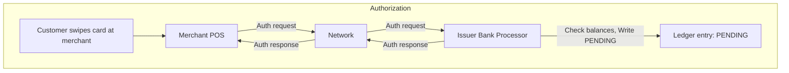
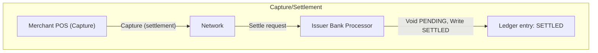

Many transactions have multi-step lifecycles where funds are first authorized at a pending layer and later settle. To the end user these transactions are logically a single event, but there may actually be multiple ledgering events that occur to the model the lifecycle of the transaction. ISO-8583 card authorizations are the canonical example, highly simplified:


**Step 1: Authorize**

 
**Step 2: Capture/Settle**


This tutorial walks through modeling that lifecycle in Twisp. You will:

- define layered tran codes for pending and settled states
- post an authorization, inspect correlated transactions, and understand the metadata that ties them together
- void the authorization while posting the settled capture in a single mutation batch
- automate transaction id generation via `VOID_AND_POST` workflow helper
- build an activity feed index that hides void noise for end users

## Prerequisites

- Access to Twisp’s Financial GraphQL API (for example via GraphiQL).
- Journal and account identifiers for the ledger you want to write to. The examples below reuse the [demo IDs from the example setup script.](/tutorials/example-setup)
- Familiarity with posting an initial transaction: voiding requires the original `transactionId`.

Replace UUID defaults in the snippets with values from your environment when running them against a live ledger.

## Step 1 — Create layered tran codes

Tran codes define the accounting logic that `postTransaction` reuses. We will create one code to place a hold on the PENDING layer and another to settle on the SETTLED layer. Both share a `correlationId` so they can be queried as a single lifecycle.

```graphql
mutation CreateLifecycleTranCodes(
  $pendingTranCodeId: UUID! = "e62e2a14-ba73-11f0-a918-069b540ea27c"
  $settledTranCodeId: UUID! = "ec828824-ba73-11f0-a35f-069b540ea27c"
) {
  pending: createTranCode(
    input: {
      tranCodeId: $pendingTranCodeId
      code: "SAMPLE_TRANSFER_PENDING"
      description: "Place funds on hold at the pending layer."
      metadata: { category: "Card" }
      params: [
        { name: "crAccount", type: UUID, description: "Account to credit." }
        { name: "drAccount", type: UUID, description: "Account to debit." }
        { name: "amount", type: DECIMAL, description: "Authorized amount." }
        { name: "currency", type: STRING, description: "ISO-4217 currency." }
        { name: "effective", type: DATE, description: "Authorization date." }
        {
          name: "journalId"
          type: UUID
          description: "Journal that records this flow."
          default: "c2881874-007e-43e1-85ef-c263e8e361aa"
        }
        {
          name: "correlationId"
          type: STRING
          description: "Identifier shared across the lifecycle."
        }
        {
          name: "metadata"
          type: JSON
          description: "Optional JSON payload for webhooks."
          default: "{}"
        }
      ]
      transaction: {
        journalId: "params.journalId"
        effective: "params.effective"
        correlationId: "params.correlationId"
        description: "'Authorization hold for ' + string(params.amount) + ' ' + params.currency"
        metadata: "params.metadata"
      }
      entries: [
        {
          accountId: "params.drAccount"
          units: "params.amount"
          currency: "params.currency"
          entryType: "'AUTH_PENDING_DR'"
          direction: "DEBIT"
          layer: "PENDING"
        }
        {
          accountId: "params.crAccount"
          units: "params.amount"
          currency: "params.currency"
          entryType: "'AUTH_PENDING_CR'"
          direction: "CREDIT"
          layer: "PENDING"
        }
      ]
    }
  ) {
    tranCodeId
    code
  }

  settled: createTranCode(
    input: {
      tranCodeId: $settledTranCodeId
      code: "SAMPLE_TRANSFER_SETTLED"
      description: "Post the settled capture and release the hold."
      metadata: { category: "Card" }
      params: [
        { name: "crAccount", type: UUID, description: "Account to credit." }
        { name: "drAccount", type: UUID, description: "Account to debit." }
        { name: "amount", type: DECIMAL, description: "Captured amount." }
        { name: "currency", type: STRING, description: "ISO-4217 currency." }
        {
          name: "effective"
          type: DATE
          description: "Settlement posting date."
        }
        {
          name: "journalId"
          type: UUID
          description: "Journal that records this flow."
        }
        {
          name: "correlationId"
          type: STRING
          description: "Identifier shared across the lifecycle."
        }
        {
          name: "metadata"
          type: JSON
          description: "Optional JSON payload for webhooks."
          default: "{}"
        }
      ]
      transaction: {
        journalId: "params.journalId"
        effective: "params.effective"
        correlationId: "params.correlationId"
        description: "'Capture settled for ' + string(params.amount) + ' ' + params.currency"
        metadata: "params.metadata"
      }
      entries: [
        {
          accountId: "params.drAccount"
          units: "params.amount"
          currency: "params.currency"
          entryType: "'AUTH_CAPTURE_DR'"
          direction: "DEBIT"
          layer: "SETTLED"
        }
        {
          accountId: "params.crAccount"
          units: "params.amount"
          currency: "params.currency"
          entryType: "'AUTH_CAPTURE_CR'"
          direction: "CREDIT"
          layer: "SETTLED"
        }
      ]
    }
  ) {
    tranCodeId
    code
  }
}
```

Record the two `code` values—they tie directly to the mutations we use next.

## Step 2 — Post the pending authorization

Use `postTransaction` with the pending tran code. Correlation links follow-on transactions back to this authorization. The `metadata` parameter must be JSON-encoded (pass a JSON string or variable).

```graphql
mutation PostPendingAuthorization(
  $transactionId: UUID! = "0c970fb5-29e1-4c4f-87d0-b20557a19a5a"
  $correlationId: String! = "purchase-1001"
  $creditAccountId: UUID! = "685fba2a-1ec6-4ae9-ace6-d9683d142c16"
  $debitAccountId: UUID! = "7c1afcde-7863-41b8-9688-72730f4d61f9"
  $journalId: UUID! = "c2881874-007e-43e1-85ef-c263e8e361aa"
) {
  authorize: postTransaction(
    input: {
      transactionId: $transactionId
      tranCode: "SAMPLE_TRANSFER_PENDING"
      params: {
        crAccount: $creditAccountId
        drAccount: $debitAccountId
        journalId: $journalId
        amount: "25.00"
        currency: "USD"
        effective: "2025-01-07"
        correlationId: $correlationId
        metadata: {
          merchantMcc: "5812"
          merchantName:"Coffee Bar"
        }
      }
    }
  ) {
    transactionId
    correlationId
    effective
    entries(first: 2) {
      nodes {
        entryId
        accountId
        direction
        layer
        amount {
          units
          currency
        }
      }
    }
  }
}
```

After posting, confirm the correlation in a read query:

```graphql
query AuthorizationLifecycle(
  $journalId: String! = "c2881874-007e-43e1-85ef-c263e8e361aa"
  $correlationId: String! = "purchase-1001"
) {
  transactions(
    index: { name: CORRELATION_ID }
    where: {
      journalId: { eq: $journalId }
      correlationId: { eq: $correlationId }
    }
    first: 10
  ) {
    nodes {
      transactionId
      voidOf
      voidedBy
      entries(first: 2) {
        nodes {
          layer
          amount {
            units
            currency
          }
        }
      }
    }
  }
}
```

You should see one `PENDING` transaction at this stage.

## Step 3 — Void the hold and post the capture

When settlement arrives, void the original transaction and immediately post the capture. Because both operations are mutations you can execute them in a single GraphQL document so the integration stays idempotent.

```graphql
mutation CaptureAuthorization(
  $authorizationId: UUID! = "0c970fb5-29e1-4c4f-87d0-b20557a19a5a"
  $captureId: UUID! = "4d0d1fa5-4409-4f23-8b00-2eee8369bb98"
  $correlationId: String! = "purchase-1001"
  $creditAccountId: UUID! = "685fba2a-1ec6-4ae9-ace6-d9683d142c16"
  $debitAccountId: UUID! = "7c1afcde-7863-41b8-9688-72730f4d61f9"
  $journalId: UUID! = "c2881874-007e-43e1-85ef-c263e8e361aa"
) {
  voidPending: voidTransaction(id: $authorizationId) {
    transactionId
    voidOf
    correlationId
  }

  capture: postTransaction(
    input: {
      transactionId: $captureId
      tranCode: "SAMPLE_TRANSFER_SETTLED"
      params: {
        crAccount: $creditAccountId
        drAccount: $debitAccountId
        journalId: $journalId
        amount: "25.00"
        currency: "USD"
        effective: "2025-01-08"
        correlationId: $correlationId
        metadata: {
          merchantMcc: "5812"
          merchantName:"Coffee Bar"
          captureBatchId: "batch-450"
        }
      }
    }
  ) {
    transactionId
    correlationId
    voidOf
    entries(first: 2) {
      nodes {
        layer
        direction
        amount {
          units
          currency
        }
      }
    }
  }
}
```

Re-run `AuthorizationLifecycle` and you will now see:

- the original transaction with `voidedBy` populated
- a void transaction with `voidOf` pointing back to the authorization
- the settled capture on the `SETTLED` layer

## Step 4 — Post to a single identifier via `VOID_AND_POST` workflow

Twisp’s transfer workflow wraps the pattern above. The workflow keeps state by `executionId` and uses the `VOID_AND_POST` task to post and void as needed. After creating the tran codes in Step&nbsp;1, you can orchestrate the end-to-end lifecycle like this:

```graphql
mutation WorkflowVoidAndPost(
  $executionId: UUID! = "5368ff5e-48b5-4c69-a6c3-d4efcf3804eb"
  $creditAccountId: UUID! = "685fba2a-1ec6-4ae9-ace6-d9683d142c16"
  $debitAccountId: UUID! = "7c1afcde-7863-41b8-9688-72730f4d61f9"
  $journalId: UUID! = "c2881874-007e-43e1-85ef-c263e8e361aa"
  $correlationId: String = "purchase-1002"
) {
  pending: workflow {
    execute(
      input: {
        workflowId: "c97010ac-f703-4112-8bb3-493ec0c2dfd4"
        task: "VOID_AND_POST"
        executionId: $executionId
        params: {
          tranCode: "SAMPLE_TRANSFER_PENDING"
          amount: "25.00"
          currency: "USD"
          effective: "2025-01-07"
          metadata: {
            merchantMcc: "5812"
            merchantName:"Coffee Bar"
          }
          crAccount: $creditAccountId
          drAccount: $debitAccountId
          journalId: $journalId
          correlationId: $correlationId
        }
      }
    ) {
      output {
        state
      }
    }
  }

  voidAndPost: workflow {
    execute(
      input: {
        workflowId: "c97010ac-f703-4112-8bb3-493ec0c2dfd4"
        task: "VOID_AND_POST"
        executionId: $executionId
        params: {
          tranCode: "SAMPLE_TRANSFER_SETTLED"
          amount: "25.00"
          currency: "USD"
          effective: "2025-01-08"
          metadata: {
            merchantMcc: "5812"
            merchantName:"Coffee Bar"
            captureBatchId: "batch-450"
          }
          crAccount: $creditAccountId
          drAccount: $debitAccountId
          journalId: $journalId
          correlationId: $correlationId
        }
      }
    ) {
      activities {
        action
        entityType
        entity {
          ... on Transaction {
            transactionId
            correlationId
            voidOf
            entries(first: 2) {
              nodes {
                layer
                amount {
                  units
                  currency
                }
              }
            }
          }
        }
      }
    }
  }
}
```

 
Note the `workflowId` and `task` parameters are fixed values. 


## Step 5 — Build a clean activity feed

End users expect to see a single line item even though the ledger contains three transactions (pending, void, and settled). Create a custom index that filters void/voided entries when you render an activity feed:

```graphql
mutation CreateActivityFeedIndex {
  schema {
    createIndex(
      input: {
        name: "feed"
        on: Entry
        partition: [
          { alias: "journal_id", value: "document.journal_id" }
          { alias: "account_id", value: "document.account_id" }
        ]
        sort: [
          { sort: ASC, alias: "created", value: "document.created" }
        ]
        constraints: {
          isNotVoidEntry: "!document.is_void_entry"
          isNotVoidedEntry: "!document.is_voided_entry"
        }
      }
    ) {
      id
    }
  }
}
```

Query the index with `entries(index: { name: CUSTOM, custom: { name: "feed" } }, ...)` to power a customer-facing feed that ignores internal bookkeeping noise.

---

You now have a full lifecycle: create layered tran codes, post an authorization, void and capture, utilize a workflow to ensure a single transaction effective for an id, and present a tidy history. Explore extending the workflow with additional states (for partial captures or declines) and add monitoring that alerts whenever a void happens outside of an expected settlement window.
