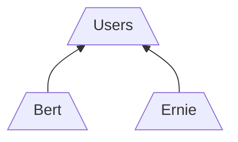
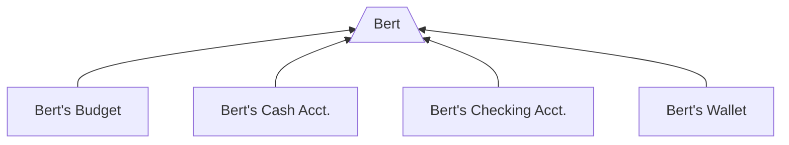
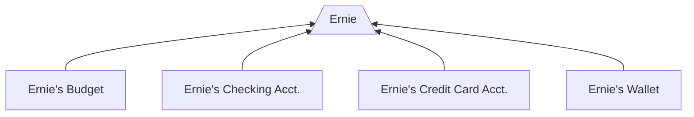
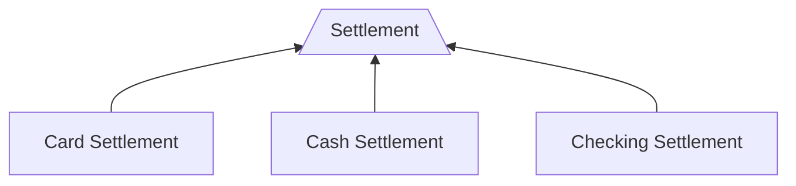
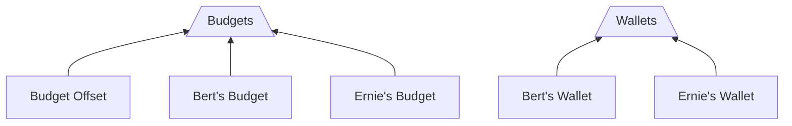

This setup is for an example budgeting app called "Budget Buddy". Think of it as a mashup of a budgeting tool like [Mint](https://mint.intuit.com/) or [YNAB](https://www.ynab.com/) with a social wallet app like [Venmo](https://venmo.com/).

**The full setup GraphQL code can be found at the bottom of this page.**

## Account Structure

Budget Buddy's chart of accounts includes account sets for each user, containing that user's wallet, budget accounts, and linked financial accounts like checking or credit cards. It also has offset and settlement account.

### User Accounts

### Settlement Accounts

### Additional Sets

Additional account sets are used to roll up wallet and budget accounts:

## Tran Codes
The setup defines several `TranCodes`:

- `ALLOC_BUDGET`: Allocates an amount to a specific budget, creating a credit entry in the account and a debit entry in the budget offset account.
- `DEALLOC_BUDGET`: Deallocates funds from a budget, creating a credit entry in the budget offset account and a debit entry in the account.
- `ASSIGN_TO_BUDGET`: Assigns a transaction to a particular budget, creating a credit entry in the account and a debit entry in the budget offset account.
- `RECORD_TX`: Records a transaction between two accounts, creating a debit entry in one account and a credit entry in another.
- `RECORD_PENDING_TX`: Records a pending transaction between two accounts, creating a debit entry in one account and a credit entry in another.
- `RECORD_SETTLE_PENDING_TX`: Records the settlement of a pending transaction, creating a credit entry in the corresponding account and a debit entry in the settlement account.
- `WALLET_TRANSFER`: Transfers funds between two wallets, creating a debit entry in one wallet and a credit entry in another.
- `WALLET_DEPOSIT`: Deposits funds into a wallet, creating a debit entry in the wallet account and a credit entry in the checking account.
- `WALLET_WITHDRAW`: Withdraws funds from a wallet, creating a debit entry in the checking account and a credit entry in the wallet account.

Each `TranCode` defines the entries that should be created in the ledger when the transaction is processed, as well as any metadata that should be associated with the transaction.

## GraphQL

