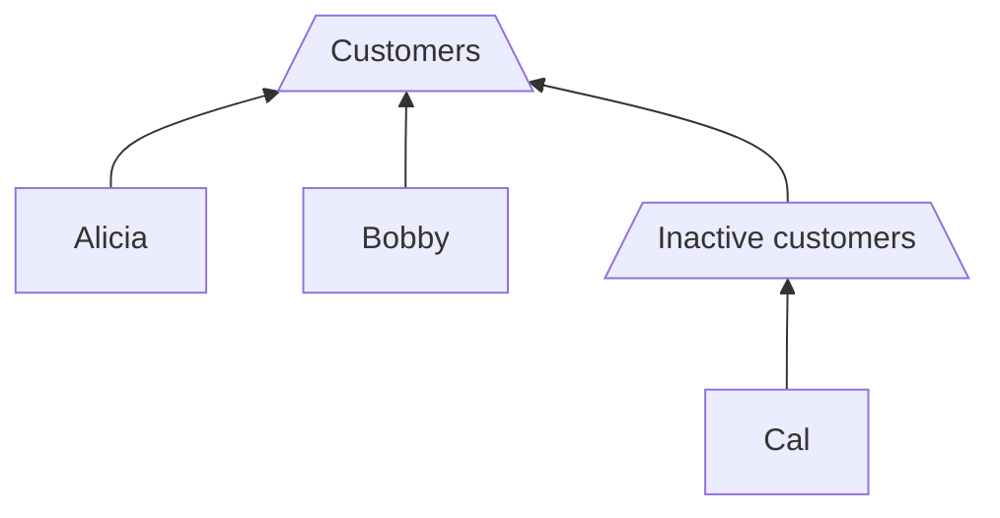

With the structure provided by account sets, you can enhance your ledger with custom materialized balances and organize accounts into groups based on their purpose or function.


- Create new sets with the `createAccountSet` mutation
- Add members to a set with the `addToAccountSet` mutation
- Get set data and its members with the `accountSet` query
- Update fields on a set with the `updateAccountSet` mutation
- Delete a set with the `deleteAccountSet` mutation


---

## Prerequisites

Before beginning this tutorial, you should have a basic understanding of Twisp's ledger system and how transactions, accounts, and entries work. Review the [](/accounting-core) docs for more context.

If you'd like to follow along with the steps in this tutorial, you should have added accounts to your ledger. See the tutorial on [](/tutorials/setting-up-accounts).



## Create an account set

To create a new [AccountSet]($gql:object:AccountSet), we'll use the `createAccountSet` mutation. This mutation takes several arguments:

- `accountSetId`: A unique identifier for the account set.
- `journalId`: The ID of the journal to which the account set belongs.
- `name`: The name of the account set.
- `description`: A description of the account set.
- `normalBalanceType`: The normal balance to use for rolling up balances for this account set (either `DEBIT` or `CREDIT`).

Let's create an account set to hold customer's accounts. We'll call it `"Customers"` and set the `normalBalanceType` to `CREDIT`:



This operation will add a new account set to the ledger. Note the `DEBIT` balance type indicates that this account set is of the type that has a debit normal balance, which means that debits increase the balance and credits decrease the balance.

## Add set members

To add an account to an account set, use the mutation `addToAccountSet`. The mutation takes two arguments:

- `id`: Unique identifier for the account set to which the member will be added.
- `member`: An `AccountSetMemberInput` object containing the unique identifier of the account or account set to be added as a member, as well as the type of member (`ACCOUNT` or `ACCOUNT_SET`).



The `addToAccountSet` field returns the updated account set, including its ID and the list of members. In this case, the list of members is limited to the first 10 nodes, and only the `accountId`, `name`, and `code` fields are included in the response.


Try creating another account for a customer named "Bobby", then add their account to the "Customers" account set.


## Nest account sets within other sets

One powerful feature of [AccountSets]($gql:object:AccountSet) is that they can be nested within other sets. This allows us to create more complex structures for our chart of accounts.

To nest one AccountSet within another, it's as simple as use the same `addToAccountSet` mutation, but with a `memberType` of `ACCOUNT_SET`. For example:

```graphql
mutation AddToAccountSetNested(
  addToAccountSet(
    id: "<ID for parent account set>"
    member: { memberId: "<ID of child account set", memberType: ACCOUNT_SET }
  ) {
    accountSetId
    members(first: 10) {
      nodes {
        __typename
        ... on AccountSet {
          accountSetId
          name
        }
      }
    }
  }
}
```

By adding nested sets, you can create tree-like structures. Can you recreate this tree using the commands you've learned so far?



## Query members of an account set

To query the members, we'll use the `accountSet` query and request the `members` field of the "Customers" set created earlier.



Note that the `members` field returns a paginated response. Because account sets can contain accounts _or_ other account sets, we can use an [inline fragment](https://graphql.org/learn/queries/#inline-fragments) to specify which fields are to be returned depending on the type.

The "Customers" set only contains accounts at this point, so no fields for account sets need to be specified.


If you are unfamiliar with union types in GraphQL, you can find a good summary on the official docs: [https://graphql.org/learn/schema/#union-types](https://graphql.org/learn/schema/#union-types).


## Update fields on an account set

The `updateAccountSet` mutation is used to update fields of an existing account set (name, description, metadata, etc.).

It takes as input the `id` of the account set to be updated and an `input` object containing the fields to update.



This mutation can be useful when there is a need to update the name of an existing account set due to changes in an organization's structure or operations. The response from the mutation can be used to verify that the update was successful and to track changes to the account set over time.

## Delete an account set

The `deleteAccountSet` mutation is used to delete an existing account set. It takes as input the `id` of the account set to be deleted.



This mutation can be useful when an account set is no longer needed or was created in error.

## Conclusion

In this tutorial, we've explored how to use [AccountSets]($gql:object:AccountSet) to organize accounts.

We've covered how to create an account set, add members to it, nest sets within other sets, query set members, update fields of a set, and delete a set.

By using account sets to organize your chart of accounts, you can create more flexible and powerful structures that better fit the needs of your business or organization.
